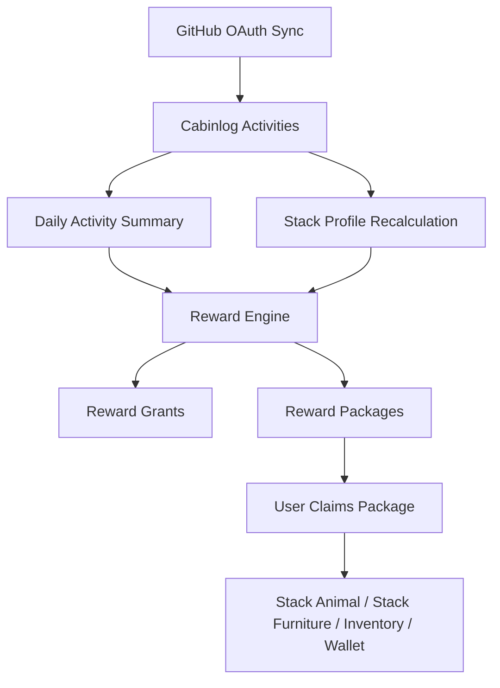

# Cabinlog Game Design Foundation

This document defines the first backend-facing game design rules for Cabinlog.
It is intentionally scoped to rewards, stack identity, package delivery, and
sync outcomes. Rendering, animation, shop, social, ranking, and detailed
balancing are out of scope.

## Goals

1. Reward real developer activity without encouraging spam.
2. Make daily consistency more valuable than one-day volume spikes.
3. Let GitHub stack identity change over time without removing earned rewards.
4. Deliver rewards through packages so the game client can present a clear
   "something arrived" moment after sync.
5. Keep all unlocks idempotent and auditable through grant keys.

## Core Loop



## Cabin Presentation

The player home is an isometric cabin room. The first playable screen should
feel like a usable room, not a marketing page or abstract stats screen.

Room presentation rules:

1. Rewards appear as packages delivered into the cabin.
2. Pets idle and evolve inside the room.
3. Furniture is placed on an isometric grid.
4. GitHub progress is visible through in-room objects, not separate floating UI
   by default.
5. A cabin dashboard board can show commit, PR, issue, streak, and stack data.

Initial cabin grid:

| Property | Value |
| --- | --- |
| Room shape | Isometric rectangle |
| Logical size | `8 x 8` floor cells |
| Placement coordinate | `x`, `y`, `z`, `rotation` |
| Wall zones | Back-left wall, back-right wall |
| Floor zones | Floor base, carpet layer, furniture layer |
| Dashboard object | `furniture.dev-board` |

In-room dashboard board:

| Board section | Displayed data |
| --- | --- |
| Today | commit count, PR count, issue count, earned coins, daily cap progress |
| Week | active days, activity points, streak |
| Stack | top 5 languages by absolute bytes, current mastery level |
| Leaderboard style | Personal leaderboard inside the room, not global ranking |

Dashboard data should come from backend summaries. The room renderer should not
calculate reward rules.

## Activity Reward Points

Raw GitHub events should not directly mutate pets, inventory, or cabin state.
They are first normalized into Cabinlog activities, then summarized and rewarded.

Default activity point weights:

| Activity type | Base points | Coin reward | Daily coin contribution cap | Primary reward intent |
| --- | ---: | ---: | ---: | --- |
| `COMMIT` | 4 | 3 | 45 | Food and small EXP |
| `PUSH` | 6 | 4 | 24 | Food and small coin |
| `PULL_REQUEST_OPENED` | 18 | 18 | 54 | Coin and EXP |
| `PULL_REQUEST_MERGED` | 35 | 35 | 70 | Coin, EXP, growth material |
| `ISSUE` | 10 | 10 | 40 | Coin and planning score |
| `REVIEW` | 22 | 22 | 66 | Collaboration EXP |
| `RELEASE` | 45 | 50 | 100 | Rare material |

Initial MVP can calculate rewards from `COMMIT`, `PULL_REQUEST_OPENED`,
`PULL_REQUEST_MERGED`, and `ISSUE`. Other activity types can remain reserved
until ingestion exists.

## Daily Caps

Daily caps prevent reward farming and keep the experience balanced for users
with very different repository sizes.

Default daily reward caps:

| Reward bucket | Daily cap |
| --- | ---: |
| Food | 10 |
| Coins | 150 |
| Pet EXP | 300 |
| Growth material | 3 |
| Package count from daily activity | 1 |

Point-to-reward conversion after caps:

| Metric | Conversion |
| --- | --- |
| Food | `min(10, floor(total_points / 12))` |
| Coins | `min(150, sum(activity_coin_rewards_after_type_caps))` |
| Pet EXP | `min(300, total_points * 4)` |
| Growth material | `min(3, merged_pr_count)` |

Recommended daily coin examples:

| Daily activity | Raw coins | Coins after caps |
| --- | ---: | ---: |
| 5 commits | 15 | 15 |
| 15 commits | 45 | 45 |
| 1 opened PR + 5 commits | 33 | 33 |
| 2 merged PRs + 10 commits | 100 | 100 |
| Heavy day with commits, PRs, reviews, release | `150+` | 150 |

Daily reward grant key:

```text
daily:{yyyy-mm-dd}:github-activity
```

Recommended daily time basis:

1. Store all activity timestamps in UTC.
2. Add a user timezone setting before implementing daily rewards.
3. Derive the daily reward date by converting `occurred_at` into the user's
   timezone and applying a 05:00 local-day cutoff.
4. If a user has not configured a timezone, use `UTC`.

The 05:00 cutoff avoids splitting late-night coding sessions across two reward
days while keeping the rule deterministic. The date embedded in the grant key
must be the derived reward date, not the raw database date.

The daily reward can be recalculated during the day, but package creation must
remain idempotent. If incremental daily top-ups are needed later, use a separate
ledger entry per bucket, not duplicate packages.

## Stack Profile

Stack identity must use absolute volume, ratio, and recency together.
Unlocks and evolution are primarily based on absolute language volume. Ratio is
used for representative-stack ordering, bonus weighting, and UI emphasis, not
as the sole unlock condition.

Rationale:

1. Ratio alone overvalues tiny repositories that are 100 percent one language.
2. Absolute volume alone overvalues old inactive repositories.
3. Recency alone makes identity unstable.

Per-language stack profile fields:

| Field | Meaning |
| --- | --- |
| `language` | GitHub language name |
| `total_bytes` | Total bytes across synced repositories |
| `ratio` | Language bytes divided by all language bytes |
| `repository_count` | Number of repositories containing the language |
| `recent_activity_count` | Recent Cabinlog activity count associated with that language |
| `score` | Calculated stack score |
| `tier` | Unlock tier derived from score and thresholds |
| `mastery_level` | Absolute-volume reward level used for stack unlocks |
| `calculated_at` | Last calculation time |

Default stack score:

```text
stack_score =
  log10(total_bytes + 1) * 20
  + ratio * 35
  + min(recent_activity_count, 30) * 3
  + min(repository_count, 10) * 2
```

Default tier thresholds:

| Tier | Name | Minimum requirements |
| --- | --- | --- |
| 0 | Unseen | Below tier 1 |
| 1 | Familiar | `total_bytes >= 50,000` or `recent_activity_count >= 10` |
| 2 | Practiced | `total_bytes >= 250,000` and `recent_activity_count >= 5` |
| 3 | Specialist | `total_bytes >= 1,000,000` and `recent_activity_count >= 15` |

Tier can go down after future syncs. Earned rewards must not be removed.

## Stack Mastery Levels

Stack mastery is the concrete growth ladder for each language. It answers when
the user receives the first package and when that owned stack reward levels up.
Each stack reward is either an animal or a furniture track, not both.

Mastery levels are calculated per language from absolute synced language bytes
and activity evidence. Ratio does not unlock mastery by itself.

Default mastery thresholds:

| Level | Name | Absolute volume requirement | Activity requirement | Unlock result |
| --- | --- | ---: | --- | --- |
| 0 | Seed | Below level 1 | None | No stack package |
| 1 | Spark | `50,000` bytes | or `10` recent activities | First stack package and level 1 reward |
| 2 | Habit | `250,000` bytes | and `5` recent activities | Owned stack reward upgrades to level 2 |
| 3 | Craft | `1,000,000` bytes | and `15` recent activities | Owned stack reward upgrades to level 3 |
| 4 | Mastery | `3,000,000` bytes | and `30` recent activities across at least `7` active days | Owned stack reward upgrades to level 4 |
| 5 | Signature | `10,000,000` bytes | and `75` recent activities across at least `21` active days | Owned stack reward upgrades to level 5 |

Recent activity window:

```text
recent_activity_window_days = 30
```

Active day means a calendar day with at least one counted Cabinlog activity for
that language. Active day requirements prevent old large repositories from
unlocking high-tier evolution without current engagement.

Level calculation rule:

```text
mastery_level = highest level where
  total_language_bytes >= absolute_volume_requirement
  and activity requirements are satisfied
```

Exception for level 1:

```text
level_1_unlock =
  total_language_bytes >= 50,000
  or recent_activity_count >= 10
```

This lets a new developer receive an early package even before the synced byte
volume is large, while levels 2-5 require stronger evidence.

## Stack Unlocks

Stack unlocks are based on current mastery transitions, but ownership is
permanent. If a user unlocks a Python stack reward and later Python ratio drops,
the owned reward remains at its highest claimed level. Only active bonuses and
recommendation order should change with current stack score.

The main reward for a language is not reissued at every level. Level 1 creates
the owned stack reward. Higher levels create upgrade packages for that same
reward track.

Default stack unlock ladder:

| Mastery level | Package type | Package item | Claim result |
| ---: | --- | --- | --- |
| 1 | Origin package | Language reward seed | Creates the owned stack reward at level 1 |
| 2 | Upgrade package | Level 2 upgrade material | Upgrades the owned stack reward to level 2 |
| 3 | Evolution package | Level 3 evolution material | Upgrades/evolves the owned stack reward to level 3 |
| 4 | Mastery package | Level 4 mastery material | Upgrades the owned stack reward to level 4 |
| 5 | Signature package | Level 5 signature material | Upgrades the owned stack reward to level 5 |

Stack unlock grant key:

```text
stack_reward_upgrade:{language_slug}:level:{mastery_level}:{reward_key}
```

Current backend implementation:

1. `GET /api/v1/game/settings` and `PATCH /api/v1/game/settings` manage the
   user's IANA timezone for daily reward windows.
2. `GET /api/v1/game/activity/daily-summary` exposes daily activity counts and
   capped reward preview values for the selected reward date.
3. `POST /api/v1/game/activity/daily-reward` creates the selected date's daily
   activity reward package once.
4. `POST /api/v1/github/sync` refreshes GitHub repositories, languages, and
   activities, then recalculates stack profiles.
5. Stack reward packages are created for every newly reached mastery level.
6. `GET /api/v1/game/stacks` exposes the calculated profiles.
7. `GET /api/v1/rewards/packages` exposes delivered packages.
8. `POST /api/v1/rewards/packages/{package_id}/claim` claims a package and
   creates or upgrades the owned stack reward.
9. Wallet and inventory balance mutation during claim is not implemented yet.

Default language reward keys:

| Language | Reward type | Main reward key | Level 1 form | Level 2 form | Level 3 form | Level 4 form | Level 5 form |
| --- | --- | --- | --- | --- | --- | --- | --- |
| Python | Animal | `stack.python-serpent` | Small serpent companion | Desk curl idle pose | Script-shed evolved form | Soft interpreter glow | Lab companion form |
| TypeScript | Furniture | `stack.terminal-desk` | Basic terminal desk | UI monitor attachment | Component board upgrade | Neon trace lighting | Control room workstation |
| Java | Animal | `stack.coffee-sprout` | Small coffee sprout | Cafe helper form | Roasted-bean evolved form | Aroma trail aura | Cafe master companion |
| Rust | Furniture | `stack.forge-bench` | Basic forge bench | Forge lamp attachment | Anvil table upgrade | Spark aura lighting | Workshop station |
| Go | Animal | `stack.cloud-helper` | Small cloud companion | Server shelf helper form | Deploy-cloud evolved form | Wind trail aura | Infra master companion |

Reward keys are Cabinlog-owned concepts. They must not copy trademarked
characters or exact project mascots.

Stack-themed reward catalog:

| Stack | Reward type | Reward concept | Room visual identity | Food/material concept |
| --- | --- | --- | --- | --- |
| Python | Animal | Flexible serpent-like companion | Calm lab corner with papers and small lamps | Warm byte biscuit, shed scale |
| TypeScript | Furniture | Terminal desk with UI monitor and component board | Bright workstation with panels and status lights | Signal candy, typed core |
| Java | Animal | Coffee sprout companion | Warm cafe desk with brewing tools | Roasted bean, warm cup |
| Rust | Furniture | Forge bench with lamp, anvil table, and metal rack | Workshop corner with sparks and gears | Gear treat, forge core |
| Go | Animal | Cloud helper companion | Light infrastructure corner with cloud/server motifs | Cloud puff, deploy token |
| JavaScript | Furniture | Browser console table with script poster | Playful scripting corner with yellow accent lights | Spark snack, event loop bead |
| C/C++ | Furniture | Circuit bench with compiler cabinet | Low-level hardware corner with boards and tools | Bit chip, linker plate |
| C# | Furniture | Studio desk with blueprint panel | Clean toolsmith corner with polished panels | Sharp candy, crystal shard |
| Kotlin | Animal | Night fox companion | Compact mobile studio corner | Moon jelly, coroutine thread |
| Swift | Animal | Swiftlet light companion | Bright app studio corner | Feather cookie, app icon gem |
| PHP | Animal | Pantry blob companion | Retro web cabin corner | Purple jelly, request token |
| Ruby | Animal | Gem sprite companion | Cozy craft corner with red gem accents | Gem candy, polished shard |
| Shell | Furniture | Command crate with log board | Utility corner with crates and cables | Command chip, shell fragment |
| SQL | Furniture | Data cabinet with query table | Organized archive corner with drawers | Data grain, index tag |
| Docker | Furniture | Container shelf with deploy crate | Shipping/storage corner with labeled boxes | Container cracker, image seal |

The initial MVP should implement Python, TypeScript, Java, Rust, and Go first.
Other stack rows define future reward keys and visual direction.

## Animal Reward Evolution

Animal rewards are one possible stack reward type. They are unlocked at level 1
and evolve when the same stack reward is upgraded. An animal should never
disappear or downgrade when stack ratio decreases.

Animal lifecycle:

| Stage | Name | How obtained | Backend state |
| ---: | --- | --- | --- |
| 0 | Package item | Level 1 package pending | Package item only |
| 1 | Companion | Claim level 1 package | `user_stack_rewards.stage = 1`, `stack_reward_level = 1` |
| 2 | Skilled companion | Claim level 3 upgrade and meet growth requirement | `user_stack_rewards.stage = 2`, `stack_reward_level = 3` |
| 3 | Master companion | Claim level 4 upgrade and meet growth requirement | `user_stack_rewards.stage = 3`, `stack_reward_level = 4` |

Animal growth requirements:

| Evolution | Required stack mastery | Required pet EXP | Required material |
| --- | ---: | ---: | --- |
| Stage 1 -> 2 | Level 3 | `1,200` | `1` language evolution material |
| Stage 2 -> 3 | Level 4 | `4,000` | `3` language evolution materials |

Animal EXP is earned from daily activity packages, not directly from raw GitHub
events. The reward engine should target the currently featured animal by
default. If no animal is featured, EXP can be stored as unassigned account EXP
or applied to the highest-scoring animal stack later.

Upgrade package behavior:

1. If the user owns the stack reward and meets pet EXP/material requirements,
   claim can upgrade/evolve it immediately.
2. If the user does not meet pet EXP/material requirements, claim records the
   unlocked upgrade material and leaves the visible reward unchanged.
3. A later claim or explicit evolution API can consume stored materials once
   requirements are met.

## Furniture Reward Progression

Furniture rewards are the other possible stack reward type. Higher mastery
levels upgrade the language-themed furniture tied to the existing reward track.

Furniture tiers:

| Tier | Unlock source | Purpose |
| ---: | --- | --- |
| 1 | Stack mastery level 2 | Existing stack reward gains basic cabin object |
| 2 | Stack mastery level 3 | Existing object upgrades into a stronger workstation theme |
| 3 | Stack mastery level 5 | Existing object expands into a signature room set |

Furniture ownership is permanent. If the user loses mastery level after sync,
owned furniture remains available and does not downgrade, but current-stack
bonus decorations can be shown lower in recommendation order.

## Shop Catalog

The shop sells cabin customization and pet care items. Shop purchases should
use coins earned from daily activity. Stack mastery items should mostly come
from packages, not the shop, so developer identity still feels earned.

Coin economy:

| Economy setting | Value |
| --- | ---: |
| Daily coin cap | 150 |
| Expected light day income | 15-40 |
| Expected normal day income | 50-100 |
| Expected heavy day income | 120-150 |
| Early wallpaper target price | 180-300 |
| Early furniture target price | 250-600 |
| Premium non-paid rare target price | 1,200-2,000 |

Initial shop categories:

| Category | Example item keys | Price range | Notes |
| --- | --- | ---: | --- |
| Wallpaper | `wallpaper.pine`, `wallpaper.night-grid`, `wallpaper.cafe-plaster` | 180-450 | Changes wall texture/color |
| Floor design | `floor.oak`, `floor.stone-tile`, `floor.dark-grid` | 180-450 | Changes base floor |
| Carpet/rug | `rug.green-check`, `rug.terminal-mat`, `rug.coffee-round` | 120-350 | Placed above floor |
| Generic furniture | `furniture.small-table`, `furniture.bookcase`, `furniture.plant-pot` | 250-700 | Not stack-gated |
| Dashboard boards | `furniture.dev-board`, `furniture.issue-board`, `furniture.stack-board` | 300-900 | Displays GitHub summaries |
| Pet clothes | `petwear.ribbon`, `petwear.tiny-hoodie`, `petwear.work-apron` | 250-800 | Cosmetic only |
| Food | `food.byte-biscuit`, `food.commit-cookie`, `food.review-tea` | 20-80 | Used for affection or small EXP |
| Growth support | `material.training-note`, `material.polish-kit` | 200-500 | Helps pet growth, does not replace stack mastery |
| Lighting | `light.desk-lamp`, `light.neon-line`, `light.candle-set` | 180-600 | Cabin ambience |

Shop constraints:

1. The shop must not sell direct stack mastery levels.
2. The shop can sell generic food/materials but not bypass absolute stack
   thresholds.
3. Stack-themed cosmetics can appear in the shop only after the user has
   unlocked the related stack reward.
4. Coin sinks should be mostly cosmetic to avoid punishing missed days.

## Daily Reward Levels

Daily rewards are capped per day but can have streak quality levels. This keeps
ordinary daily activity rewarding without making one day of heavy work dominate
the economy.

Daily activity level:

| Daily level | Point range | Package contents before caps |
| ---: | --- | --- |
| 0 | `0` | No daily package |
| 1 | `1-29` | Small food + small coin |
| 2 | `30-79` | Food + coin + pet EXP |
| 3 | `80-149` | More food + coin + pet EXP |
| 4 | `150+` | Capped food/coin/EXP + chance for growth material |

Daily level does not bypass daily caps. It affects package copy, presentation,
and whether rare material can appear.

Recommended daily grant keys:

```text
daily:{yyyy-mm-dd}:github-activity:level:{daily_level}
daily_topup:{yyyy-mm-dd}:{bucket}
```

Use the first key for MVP. Use `daily_topup` later only if the product needs
incremental package upgrades after multiple syncs in one day.

## Package Delivery

Rewards should arrive as packages. Sync should create pending packages, not
directly mutate final owned-game objects except for immutable grant records.

Package statuses:

| Status | Meaning |
| --- | --- |
| `PENDING` | Created and waiting for claim |
| `CLAIMED` | User claimed the package |
| `EXPIRED` | Reserved for future time-limited rewards |

Package sources:

| Source | Meaning |
| --- | --- |
| `GITHUB_SYNC` | Stack unlock or sync milestone |
| `DAILY_REWARD` | Daily activity reward package |
| `ACHIEVEMENT` | Future achievement package |

Recommended package titles:

| Source | Title pattern |
| --- | --- |
| Stack origin package | `{Language} origin package` |
| Stack upgrade package | `{Language} level {level} upgrade package` |
| Stack evolution package | `{Language} evolution package` |
| Daily activity | `Today's developer care package` |

Claim behavior:

1. Claim validates package ownership and `PENDING` status.
2. Claim creates owned pet, inventory item, wallet balance, or material balance.
3. Claim changes package status to `CLAIMED`.
4. Claim must be idempotent from the user perspective; a second claim attempt
   should not duplicate rewards.

## Persistence Boundary

Recommended next backend tables:

```text
user_stack_profiles
- id
- user_id
- language
- total_bytes
- ratio
- repository_count
- recent_activity_count
- active_days_30d
- score
- tier
- mastery_level
- calculated_at
- created_at
- updated_at
```

```text
reward_grants
- id
- user_id
- grant_key
- source
- created_at
```

```text
reward_packages
- id
- user_id
- source
- status
- title
- description
- created_at
- claimed_at
- metadata
```

```text
reward_package_items
- id
- package_id
- item_type
- item_key
- quantity
- metadata
```

Later tables:

```text
user_wallets
user_stack_rewards
user_inventory
cabin_items
```

Initial `user_stack_rewards` shape:

```text
user_stack_rewards
- id
- user_id
- reward_key
- reward_type
- source_language
- stage
- stack_reward_level
- exp
- is_featured
- created_at
- updated_at
```

Initial `user_inventory` shape:

```text
user_inventory
- id
- user_id
- item_type
- item_key
- quantity
- created_at
- updated_at
```

Do not implement final pet/cabin mutation before package creation and claim
semantics are stable.

## Sync Outcome Rules

After `POST /api/v1/github/sync` or OAuth callback sync:

1. Store/update GitHub repositories and activities.
2. Recalculate stack profiles.
3. Generate missing stack unlock grants.
4. Create pending packages for new grants.
5. Generate or update the current daily reward package.
6. Return sync counts and newly created package count once reward APIs exist.

Current implemented sync endpoints do only step 1. Steps 2-6 are the next game
foundation milestone.

## Ownership Rules

1. Earned pets and furniture are permanent.
2. Current stack tier can decrease.
3. Decreased tier disables only current bonuses, featured recommendations, or
   future eligibility. It does not revoke owned rewards.
4. Duplicate package creation is prevented by `reward_grants.grant_key`.
5. Package claim is separate from package creation.

## MVP Milestones

1. Stack profile calculation from repository language bytes and recent activity.
2. Reward grant ledger and package tables.
3. Package creation during sync for stack unlocks.
4. Package list and claim APIs.
5. Daily activity summary and capped daily reward package.
6. Pet/inventory/wallet materialization on claim.
