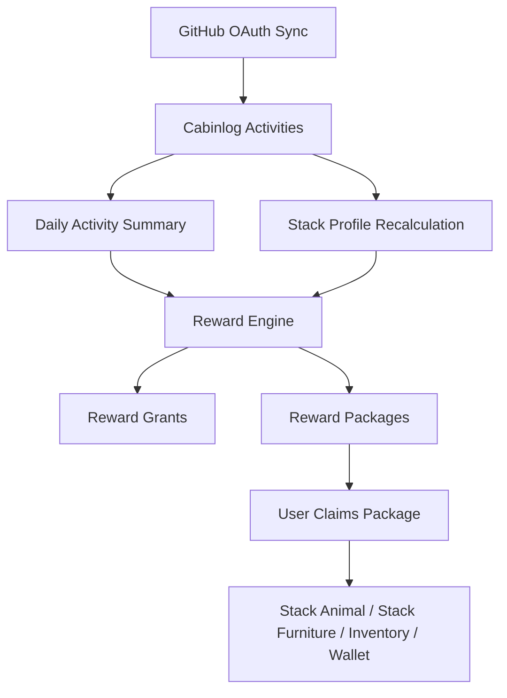

# Cabinlog 게임 디자인 기반

이 문서는 Cabinlog의 첫 번째 백엔드 연동용 게임 디자인 규칙을 정의합니다.
범위는 reward, stack identity, package delivery, sync 결과 처리입니다.
렌더링, 애니메이션, shop, social, ranking, 세부 밸런싱은 현재 범위에서 제외합니다.

## 목표

1. 실제 개발 활동을 보상하되 spam을 유도하지 않는다.
2. 하루에 몰아서 하는 활동보다 매일 꾸준한 활동이 더 좋은 경험이 되게 한다.
3. GitHub stack identity가 바뀌어도 이미 획득한 보상은 제거하지 않는다.
4. Sync 후 "소포가 도착했다"는 명확한 순간을 만들기 위해 reward를 package로 전달한다.
5. 모든 unlock은 grant key로 중복 없이 감사 가능하게 만든다.

## 핵심 루프



## Cabin Presentation

사용자 home은 아이소메트릭 오두막 방입니다. 첫 playable screen은 추상적인
통계 화면이 아니라 실제로 사용할 수 있는 방처럼 느껴져야 합니다.

방 표현 규칙:

1. Reward는 소포로 방 안에 도착합니다.
2. Pet은 방 안에서 idle 상태로 지내고 진화합니다.
3. Furniture는 isometric grid에 배치합니다.
4. GitHub progress는 기본적으로 별도 floating UI가 아니라 방 안의 object로 보여줍니다.
5. Cabin dashboard board가 commit, PR, issue, streak, stack data를 표시합니다.

초기 cabin grid:

| Property | Value |
| --- | --- |
| Room shape | Isometric rectangle |
| Logical size | 고정 `12 x 12` floor cells |
| Tile render size | `60 x 30 px` diamond |
| Tile vertical height | `46 px` per `z` level |
| Projected floor size | 벽/장식 여백 제외 약 `720 x 360 px` |
| Placement coordinate | `x`, `y`, `z`, `rotation`, `width`, `depth` |
| Wall zones | Back-left wall, back-right wall |
| Floor zones | Floor base, carpet layer, furniture layer |
| Height placement | 선반, 벽걸이, dashboard처럼 `z > 0` 위치에도 배치 가능 |
| Dashboard object | `system.dev-board` |

초기 isometric projection 계약:

```text
screen_x = (grid_x - grid_y) * (tile_width / 2)
screen_y = (grid_x + grid_y) * (tile_height / 2) - grid_z * tile_z_height
```

Frontend projection source:

1. Projection 구현은 `src/frontend/src/utils/cabinProjection.ts`가 담당합니다.
2. `CabinGridContract`는 generated OpenAPI `CabinResponse`에서 `width`, `depth`, `tile_width`, `tile_height`, `tile_z_height`만 가져온 타입입니다.
3. `CabinPhaserStage`는 backend state의 cabin 계약을 받아 같은 projection으로 floor 위에 visible isometric debug grid를 그립니다.
4. Debug grid의 `0,0` marker와 중앙 marker는 실제 배치 가능 영역과 cabin artwork가 어긋나는지 직접 확인하기 위한 전처리 도구입니다.
5. Debug grid가 표시하는 `12 x 12`, `60 x 30`, `z=46` 계약은 backend cabin 저장/검증 계약과 동일해야 합니다.
6. Debug grid는 일부 기준점에 `z=1..3` vertical guide marker를 표시해 wall-mounted object, shelf, dashboard 같은 높이 배치를 검증할 수 있게 합니다.

초기 Phaser renderer 계약:

1. `/cabin` playable init screen은 Phaser `1280 x 720` FIT canvas를 사용합니다.
2. Camera world는 `1500 x 800`이며, cabin room base의 중심을 world 중앙에 맞춥니다.
3. 첫 room base asset은 `src/frontend/public/sprites/img/wallpaper/wall.png`와 `src/frontend/public/sprites/img/floor/floor.png`입니다.
4. Wall과 floor asset은 이미 isometric projection으로 제작된 단일 이미지이며, Phaser Scene에서 같은 scale로 중앙 정렬합니다.
5. Camera는 방향키 이동, `Q`/`E` 축소/확대, mouse wheel zoom, pointer drag pan을 지원합니다.
6. Layer 순서는 wall base를 먼저 그리고 floor base를 나중에 그려 floor가 전면에 오도록 합니다.
7. 사용자 배치 object는 이후 같은 Scene에서 `screen_x`, `screen_y` projection 공식을 사용해 floor 위에 렌더링합니다.

Cabin Phaser tuning point:

1. `CABIN_WORLD_WIDTH`, `CABIN_WORLD_HEIGHT`: camera가 이동할 수 있는 world 크기입니다.
2. `CABIN_WORLD_CENTER_X`, `CABIN_WORLD_CENTER_Y`: wall/floor room base가 정렬되는 world 중심입니다.
3. `WALL_CENTER_Y`: wall asset의 vertical 위치입니다. 값을 줄이면 벽이 위로 올라갑니다.
4. `FLOOR_CENTER_Y`: floor asset의 vertical 위치입니다. 값을 줄이면 바닥이 위로 올라갑니다.
5. `CABIN_GRID_ANCHOR_OFFSET_X`, `CABIN_GRID_ANCHOR_OFFSET_Y`: visible isometric debug grid의 anchor 보정 offset입니다. Floor asset 위치는 유지한 채 실제 placement 인식 범위를 미세 조정할 때 사용합니다.
6. `CABIN_GRID_DEBUG_Z_LEVELS`: visible z-axis guide marker가 표시할 높이 단계입니다.
7. `CAMERA_MIN_ZOOM`, `CAMERA_MAX_ZOOM`, `CAMERA_ZOOM_STEP`: camera zoom 범위와 wheel zoom 단위입니다.

배치 저장 규칙:

1. Backend가 사용자가 조정 가능한 모든 object placement를 저장합니다.
2. User placement는 고정 `12 x 12` cabin grid 안에 있어야 합니다.
3. 같은 `z` level의 object footprint는 서로 겹칠 수 없습니다.
4. `rotation`은 `0`, `90`, `180`, `270`만 허용합니다.
5. Dashboard board 같은 system placement는 locked 상태입니다.
6. Stack reward object는 사용자가 해당 reward를 보유한 뒤에만 배치할 수 있습니다.
7. Inventory/furniture object는 사용자의 inventory에 item이 존재한 뒤에만 배치할 수 있습니다.

방 내부 dashboard board:

| Board section | Displayed data |
| --- | --- |
| Today | commit count, PR count, issue count, earned coins, daily cap progress |
| Week | active days, activity points, streak |
| Stack | absolute bytes 기준 top 5 languages, current mastery level |
| Leaderboard style | Global ranking이 아니라 방 내부 개인 leaderboard |

Dashboard data는 backend summary에서 받아야 합니다. Room renderer가 reward rule을
직접 계산하면 안 됩니다.

## Login Init Presentation

로그인 init 화면은 사용자가 Cabinlog 오두막에 들어가기 전의 첫 장면입니다.
게임 내부 cabin grid와는 별도의 2D pixel-art splash scene으로 취급합니다.

기준 asset:

| Property | Value |
| --- | --- |
| Source file | `src/frontend/public/sprites/img/ui/init-page.gif` |
| Canonical pixel size | `443 x 249 px` |
| Aspect ratio | 약 `1.78:1` |
| Animation delay | `0.6s` per frame |
| Display rule | 원본 비율을 유지하며 viewport 전체를 채움 |
| CSS sizing contract | `background-size: max(100vw, 178dvh) auto` |
| Fallback fill | Dark solid fallback `#101416` |

표현 규칙:

1. 원본 pixel-art 비율은 변경하지 않고 브라우저 화면 전체를 채웁니다.
2. viewport 비율이 asset과 다르면 가장자리 일부가 crop될 수 있습니다.
3. 로그인 진입 애니메이션은 같은 비율을 유지한 상태에서 오두막 방향으로 확대합니다.
4. 제목과 로그인 panel은 scene 위에 얹되, 오두막 진입 연출 중에는 화면 아래로 빠지며 배경 확대를 방해하지 않아야 합니다.
5. 모바일 portrait 화면도 같은 fill 규칙을 사용합니다. 중요한 오브젝트는 중앙 safe area에 둡니다.

로그인 성공 후 진입 규칙:

1. GitHub OAuth callback 이후 backend는 기본적으로 `/cabin`으로 직접 redirect합니다. `/login/success`는 legacy fallback으로만 유지하며 React routing render 전에 중간 화면 없이 `/cabin`으로 치환됩니다.
2. `/cabin`이 로그인 후 첫 진입점입니다.
3. `/cabin`은 실제 cabin renderer가 붙기 전의 playable init 화면입니다.
4. `/cabin`은 `GET /api/v1/game/state`로 backend state를 읽고, 소포/설정은 화면 이동 없이 modal로 엽니다.
5. 설정 modal은 GitHub 기반 프로필 세션과 로그아웃 action을 포함합니다.
6. 사용자용 인증 흐름은 `/show-case`로 이동하면 안 됩니다. `/show-case`는 개발용 component 확인 화면으로만 남깁니다.

## Activity Reward Points

GitHub raw event가 pet, inventory, cabin state를 직접 변경하면 안 됩니다.
먼저 Cabinlog activity로 정규화하고, 이후 summary와 reward 계산을 거쳐야 합니다.

기본 activity point:

| Activity type | Base points | Coin reward | Daily coin contribution cap | 주요 보상 의도 |
| --- | ---: | ---: | ---: | --- |
| `COMMIT` | 4 | 3 | 45 | 사료와 소량 EXP |
| `PUSH` | 6 | 4 | 24 | 사료와 소량 coin |
| `PULL_REQUEST_OPENED` | 18 | 18 | 54 | coin과 EXP |
| `PULL_REQUEST_MERGED` | 35 | 35 | 70 | coin과 큰 EXP |
| `ISSUE` | 10 | 10 | 40 | coin과 정리 점수 |
| `REVIEW` | 22 | 22 | 66 | 협업 EXP |
| `RELEASE` | 45 | 50 | 100 | milestone coin |

초기 MVP에서는 `COMMIT`, `PULL_REQUEST_OPENED`, `PULL_REQUEST_MERGED`,
`ISSUE`만 reward 계산에 사용해도 됩니다. 다른 타입은 수집이 생길 때까지
예약 상태로 둡니다.

## Daily Caps

Daily cap은 reward farming을 막고, repository 규모 차이가 큰 사용자 사이의
경험을 안정화합니다.

기본 일일 보상 상한:

| Reward bucket | Daily cap |
| --- | ---: |
| Food | 10 |
| Coins | 150 |
| Pet EXP | 300 |
| Package count from daily activity | 1 |

Point를 reward로 변환하는 기본 규칙:

| Metric | Conversion |
| --- | --- |
| Food | `min(10, floor(total_points / 12))` |
| Coins | `min(150, sum(activity_coin_rewards_after_type_caps))` |
| Pet EXP | `min(300, total_points * 4)` |

권장 일일 coin 예시:

| Daily activity | Raw coins | Coins after caps |
| --- | ---: | ---: |
| Commit 5개 | 15 | 15 |
| Commit 15개 | 45 | 45 |
| PR open 1개 + commit 5개 | 33 | 33 |
| PR merge 2개 + commit 10개 | 100 | 100 |
| Commit, PR, review, release가 많은 heavy day | `150+` | 150 |

Daily reward grant key:

```text
daily:{yyyy-mm-dd}:github-activity
```

권장 일일 시간 기준:

1. 모든 activity timestamp는 UTC로 저장합니다.
2. Daily reward 구현 전에 사용자 timezone 설정을 추가합니다.
3. `occurred_at`을 사용자 timezone으로 변환한 뒤 로컬 05:00 cutoff를 적용해
   reward date를 계산합니다.
4. 사용자가 timezone을 설정하지 않았다면 `UTC`를 사용합니다.
5. API에서 reward date를 생략하면 진행 중인 reward window가 아니라 마지막으로
   완료된 reward date를 정산합니다.

05:00 cutoff는 자정 이후 이어지는 개발 세션이 두 reward day로 쪼개지는 문제를
줄이면서도 규칙을 결정적으로 유지하기 위한 기준입니다. Grant key에 들어가는
날짜는 DB 원본 날짜가 아니라 계산된 reward date여야 합니다.

GitHub history onboarding grant key:

```text
onboarding:github-history:v1
```

이 패키지는 첫 GitHub sync 이후 지금까지 수집된 전체 activity를 기준으로 한 번만
생성합니다. Daily reward와 분리하여 기존 기록을 시작 보상으로 전환하고, 이후
반복 sync에서는 같은 onboarding package를 다시 만들지 않습니다. Stack 성장과
진화는 onboarding material이 아니라 언어별 synced bytes 기반 mastery package로
처리합니다.

하루 중 reward를 다시 계산할 수는 있지만 package 생성은 idempotent해야 합니다.
추후 일일 reward를 누적 보정해야 한다면 package를 중복 생성하지 말고 bucket별
ledger를 따로 둡니다.

## Stack Profile

Stack identity는 absolute volume, ratio, recency를 함께 사용합니다.
Unlock과 evolution은 기본적으로 absolute language volume을 기준으로 합니다.
Ratio는 대표 stack 순서, bonus 가중치, UI 강조에 사용하고 단독 unlock 조건으로 쓰지 않습니다.

이유:

1. ratio만 쓰면 100 percent 단일 언어인 작은 repository가 과대평가됩니다.
2. absolute volume만 쓰면 오래된 비활성 repository가 과대평가됩니다.
3. recency만 쓰면 identity가 너무 쉽게 흔들립니다.

언어별 stack profile 필드:

| Field | Meaning |
| --- | --- |
| `language` | GitHub language name |
| `total_bytes` | synced repository 전체의 해당 언어 byte |
| `ratio` | 전체 language bytes 중 해당 언어 비율 |
| `repository_count` | 해당 언어가 포함된 repository 수 |
| `recent_activity_count` | 해당 언어와 연결된 최근 Cabinlog activity 수 |
| `score` | 계산된 stack score |
| `tier` | score와 threshold 기반 unlock tier |
| `mastery_level` | stack unlock에 사용하는 absolute-volume reward level |
| `calculated_at` | 마지막 계산 시각 |

기본 stack score:

```text
stack_score =
  log10(total_bytes + 1) * 20
  + ratio * 35
  + min(recent_activity_count, 30) * 3
  + min(repository_count, 10) * 2
```

기본 tier threshold:

| Tier | Name | Minimum requirements |
| --- | --- | --- |
| 0 | Unseen | Tier 1 미만 |
| 1 | Familiar | `total_bytes >= 50,000` 또는 `recent_activity_count >= 10` |
| 2 | Practiced | `total_bytes >= 250,000` 그리고 `recent_activity_count >= 5` |
| 3 | Specialist | `total_bytes >= 1,000,000` 그리고 `recent_activity_count >= 15` |

Tier는 미래 sync에서 내려갈 수 있습니다. 하지만 이미 획득한 reward는 제거하지 않습니다.

## Stack Mastery Levels

Stack mastery는 언어별 구체적인 growth ladder입니다. 사용자가 언제 첫 소포를 받고,
이미 보유한 stack reward가 언제 level up되는지 결정합니다. 각 stack reward는
동물 또는 가구 중 하나이며, 둘 다 동시에 지급하지 않습니다.

Mastery level은 언어별 synced language bytes와 activity evidence로 계산합니다.
Ratio만으로 mastery가 열리지는 않습니다.

기본 mastery threshold:

| Level | Name | Absolute volume requirement | Activity requirement | Unlock result |
| --- | --- | ---: | --- | --- |
| 0 | Seed | Level 1 미만 | 없음 | Stack package 없음 |
| 1 | Spark | `50,000` bytes | 또는 최근 activity `10`개 | 첫 stack package와 level 1 reward |
| 2 | Habit | `250,000` bytes | 그리고 최근 activity `5`개 | 보유 중인 stack reward가 level 2로 upgrade |
| 3 | Craft | `1,000,000` bytes | 그리고 최근 activity `15`개 | 보유 중인 stack reward가 level 3으로 upgrade |
| 4 | Mastery | `3,000,000` bytes | 그리고 최근 activity `30`개, active day `7`일 이상 | 보유 중인 stack reward가 level 4로 upgrade |
| 5 | Signature | `10,000,000` bytes | 그리고 최근 activity `75`개, active day `21`일 이상 | 보유 중인 stack reward가 level 5로 upgrade |

최근 activity window:

```text
recent_activity_window_days = 30
```

Active day는 해당 언어의 counted Cabinlog activity가 하나 이상 있는 calendar day입니다.
Active day 조건은 오래된 대형 repository만으로 고단계 진화가 열리는 문제를 막습니다.

Level 계산 규칙:

```text
mastery_level = 모든 조건을 만족하는 가장 높은 level
```

Level 1 예외:

```text
level_1_unlock =
  total_language_bytes >= 50,000
  or recent_activity_count >= 10
```

이 예외는 신규 개발자도 초반 소포를 받을 수 있게 하기 위함입니다. Level 2-5는
더 강한 증거를 요구합니다.

## Stack Unlocks

Stack unlock은 현재 mastery 전환을 기준으로 판단하되, 소유권은 영구입니다.
Python stack reward를 획득한 뒤 Python ratio가 낮아져도 보유 reward는 유지되고,
이미 claim한 최고 level도 내려가지 않습니다. 현재 stack score로 바뀌는 것은
active bonus와 추천 노출 순서 정도로 제한합니다.

언어의 핵심 reward는 level마다 새로 지급하지 않습니다. Package는 Level 1에서
owned stack reward를 만드는 unlock 용도로만 사용합니다. 이후 level up/evolution은
사용자가 보유한 animal 또는 furniture를 선택했을 때 현재 stack mastery와 EXP 조건을
확인한 뒤 실행합니다.

기본 stack unlock ladder:

| Mastery level | Unlock/level-up path | Result |
| ---: | --- | --- |
| 1 | Origin package claim | Owned stack reward를 level 1로 생성 |
| 2 | Owned reward 선택 후 level-up action | Owned stack reward를 level 2로 upgrade |
| 3 | Owned reward 선택 후 evolution action | Owned stack reward를 level 3으로 upgrade/evolve |
| 4 | Owned reward 선택 후 mastery action | Owned stack reward를 level 4로 upgrade |
| 5 | Owned reward 선택 후 signature action | Owned stack reward를 level 5로 upgrade |

Stack unlock grant key:

```text
stack_reward_unlock:{language_slug}:{reward_key}
```

현재 backend 구현 범위:

1. `GET /api/v1/game/settings`, `PATCH /api/v1/game/settings`로 daily reward window에
   사용할 사용자 IANA timezone을 관리합니다.
2. `GET /api/v1/game/activity/daily-summary`는 선택한 reward date의 activity count와
   capped reward preview 값을 반환합니다.
3. `POST /api/v1/game/activity/daily-reward`는 선택한 날짜의 daily activity reward
   package를 한 번만 생성합니다.
4. `POST /api/v1/game/rewards/sync`는 저장된 GitHub 데이터를 기준으로
   GitHub history onboarding package를 한 번 생성하고 stack profile을 재계산하며,
   마지막 완료 reward date의 daily reward package와 이벤트 조건 달성에 따른
   achievement package를 생성합니다.
5. `POST /api/v1/github/sync`가 GitHub repository, language, activity를 갱신한 뒤
   같은 game reward sync를 실행합니다.
6. `/cabin` 첫 접속은 local user와 정산 reward date 기준 하루 한 번 game reward sync를 실행하고, HUD refresh button은 같은 작업을 수동으로 다시 실행합니다.
7. 새로 level 1에 도달한 stack마다 origin package를 생성합니다.
8. `GET /api/v1/game/stacks`로 계산된 stack profile을 조회합니다.
9. `GET /api/v1/rewards/packages`로 도착한 package를 조회합니다.
10. `POST /api/v1/rewards/packages/{package_id}/claim`으로 package를 수령하고
   wallet coin 증가, inventory item 적재, owned stack reward 생성을 처리합니다.
11. `GET /api/v1/game/inventory`는 수령 완료된 보상을 소모품, 가구, 펫로그로 나누어 반환합니다.
12. `GET /api/v1/game/collection`은 stack reward catalog와 event reward catalog 기준 가구와 펫로그 도감을 반환합니다. 사료 같은 소모품은 도감 항목이 아니라 inventory 항목으로만 추적합니다.
11. `GET /api/v1/game/state`는 첫 playable cabin screen에 필요한 backend state를
   반환합니다.

기본 language reward key:

| Language | Reward type | Main reward key | Level 1 form | Level 2 form | Level 3 form | Level 4 form | Level 5 form |
| --- | --- | --- | --- | --- | --- | --- | --- |
| Python | Animal | `stack.python-serpent` | 작은 serpent companion | 책상 위 idle pose | script-shed evolved form | 은은한 interpreter glow | lab companion form |
| TypeScript | Furniture | `stack.terminal-desk` | 기본 terminal desk | UI monitor attachment | component board upgrade | neon trace lighting | control room workstation |
| Java | Animal | `stack.coffee-sprout` | 작은 coffee sprout | cafe helper form | roasted-bean evolved form | aroma trail aura | cafe master companion |
| Rust | Furniture | `stack.forge-bench` | 기본 forge bench | forge lamp attachment | anvil table upgrade | spark aura lighting | workshop station |
| Go | Animal | `stack.cloud-helper` | 작은 cloud companion | server shelf helper form | deploy-cloud evolved form | wind trail aura | infra master companion |

Reward key는 Cabinlog 자체 개념입니다. 특정 기술이나 프로젝트의 상표 캐릭터,
공식 mascot을 그대로 복제하면 안 됩니다.

Stack-themed reward catalog:

| Stack | Reward type | Reward key | Asset key | Reward concept | Room visual identity | Food/material concept |
| --- | --- | --- | --- | --- | --- | --- |
| Python | Animal | `stack.python-serpent` | `python-serpent` | 유연한 serpent-like companion | 종이와 작은 램프가 있는 차분한 lab corner | Warm byte biscuit, shed scale |
| TypeScript | Furniture | `stack.terminal-desk` | `typescript-terminal-desk` | UI monitor와 component board가 붙는 terminal desk | Panel과 status light가 있는 밝은 workstation | Signal candy, typed core |
| Java | Animal | `stack.coffee-sprout` | `java-coffee-sprout` | Coffee sprout companion | Brewing tool이 있는 따뜻한 cafe desk | Roasted bean, warm cup |
| Rust | Furniture | `stack.forge-bench` | `rust-forge-bench` | Lamp, anvil table, metal rack이 붙는 forge bench | Spark와 gear가 있는 workshop corner | Gear treat, forge core |
| Go | Animal | `stack.cloud-helper` | `go-cloud-helper` | Cloud helper companion | Cloud/server motif가 있는 가벼운 infra corner | Cloud puff, deploy token |
| JavaScript | Furniture | `stack.browser-console-table` | `javascript-browser-console-table` | Browser console table with script poster | Yellow accent light가 있는 playful scripting corner | Spark snack, event loop bead |
| C/C++ | Furniture | `stack.circuit-bench` | `cpp-circuit-bench` | Circuit bench with compiler cabinet | Board와 tool이 있는 low-level hardware corner | Bit chip, linker plate |
| C# | Furniture | `stack.blueprint-studio-desk` | `csharp-blueprint-studio-desk` | Studio desk with blueprint panel | Polished panel 중심의 clean toolsmith corner | Sharp candy, crystal shard |
| Kotlin | Animal | `stack.night-fox` | `kotlin-night-fox` | Night fox companion | Compact mobile studio corner | Moon jelly, coroutine thread |
| Swift | Animal | `stack.swiftlet-light` | `swift-swiftlet-light` | Swiftlet light companion | 밝은 app studio corner | Feather cookie, app icon gem |
| PHP | Animal | `stack.pantry-blob` | `php-pantry-blob` | Pantry blob companion | Retro web cabin corner | Purple jelly, request token |
| Ruby | Animal | `stack.gem-sprite` | `ruby-gem-sprite` | Gem sprite companion | Red gem accent가 있는 cozy craft corner | Gem candy, polished shard |
| Shell | Furniture | `stack.command-crate` | `shell-command-crate` | Command crate with log board | Crate와 cable이 있는 utility corner | Command chip, shell fragment |
| SQL | Furniture | `stack.data-cabinet` | `sql-data-cabinet` | Data cabinet with query table | Drawer 중심의 organized archive corner | Data grain, index tag |
| Docker | Furniture | `stack.container-shelf` | `docker-container-shelf` | Container shelf with deploy crate | Label box가 있는 shipping/storage corner | Container cracker, image seal |

초기 MVP는 Python, TypeScript, Java, Rust, Go를 먼저 구현합니다.
나머지 stack row는 future reward key와 visual direction을 정의합니다.

## Reward Collection UX

도감은 가구와 펫로그만 표시합니다. 소모품은 인벤토리에만 표시하고 도감에는 넣지
않습니다.

도감 표시 규칙:

1. 모든 `DEFAULT_REWARD_CATALOG`, `STACK_REWARD_CATALOG`, `EVENT_REWARD_CATALOG` 항목은 도감에 표시합니다.
2. 보유하지 않은 항목은 슬롯 내부 이름을 `?`로 표시합니다.
3. 잠긴 항목을 선택하면 상세 패널에서 실제 이름과 수령 조건을 표시합니다.
4. 기본 stack 수령 조건은 `{Language} 코드 50,000 bytes 이상` 또는
   `최근 {Language} 활동 10회 이상`입니다.
5. 보유 항목은 이름, stack, 현재 level/stage를 표시합니다.
6. 상세 패널은 `asset_key`를 함께 표시하여 추후 실제 sprite asset 연결 위치를
   확인할 수 있게 합니다.
7. GitHub 계정이 연결된 사용자는 기본 펫로그 `default.octocat`을 자동 보유합니다.
   이 항목은 도감에서 `github_account` 조건으로 표시하고, 인벤토리에서 배치/수거
   확인용 기본 펫로그로 사용합니다.
8. 배치는 인벤토리 action에서 바로 좌표를 확정하지 않습니다. 사용자가 보유 항목을
   선택하면 Phaser stage가 held pose preview를 마우스에 붙이고, 사용자가 클릭한
   isometric cell에 placement API를 호출합니다. 성공 뒤에는 전체 cabin state를 다시
   불러오지 않고 응답 placement만 local state에 추가합니다.
9. 수거는 delete API 성공 뒤 전체 cabin state를 다시 불러오지 않고 해당 placement만
   local state에서 제거합니다.

## Reward Asset Manifest

모든 asset은 isometric cabin grid 위에 배치되는 것을 전제로 제작합니다. 실제 파일이
들어오기 전까지 UI는 `asset_key`와 placeholder slot을 사용합니다. 소스 파일은
`public/sprites/aseprites` 아래, 런타임 파일은 `public/sprites/img` 아래에서 같은
카테고리 폴더 구조를 유지합니다. Phaser 배치 화면은
`src/frontend/src/utils/petLogSprites.ts`의 시트 정의를 기준으로 실제 프레임을 읽습니다.

공통 경로 규칙:

| Type | Path pattern | Notes |
| --- | --- | --- |
| Furniture | `public/sprites/{aseprites,img}/furniture/{asset_key}` | 소스와 런타임 파일을 같은 가구 폴더에서 관리 |
| Pet log spritesheet | `public/sprites/img/pet-logs/{registered-sheet-path}` | 런타임 PNG 경로이며, 원본 시트는 `aseprites/pet-logs`에서 관리 |
| Wallpaper | `public/sprites/{aseprites,img}/wallpaper/{asset_key}` | 벽, 배경, 장식용 배경 |
| Floor | `public/sprites/{aseprites,img}/floor/{asset_key}` | 바닥 타일 및 바닥 텍스처 |
| UI / Collection icon | `public/sprites/{aseprites,img}/ui/{asset_key}` | 도감/인벤토리와 초기 화면용 |

기본 펫로그:

| Reward key | Asset key | Unlock |
| --- | --- | --- |
| `default.octocat` | `default-octocat` | GitHub account connected |

기본 Octocat은 `public/sprites/img/pet-logs/cat-Sheet.png`를 사용합니다. 시트의 1-based
프레임 1~2는 sleep, 3~4는 lie, 5는 held입니다. 11번부터는 방향 순서
`left`, `upLeft`, `downLeft`, `down`, `up`, `right`, `upRight`, `downRight`로
각 방향마다 standing 2프레임과 walking 8프레임을 배치합니다. Phaser stage는
배치 대기 중 held frame을 마우스에 붙이고, 배치 후 이동 방향에 맞는 걷기 애니메이션과
정지 프레임을 선택합니다. 다른 펫로그도 같은 규격을 사용하면 해당 정의만
`petLogSprites.ts`에 추가합니다.

가구 asset 요구사항:

1. 모든 가구는 `front`, `back`, `left`, `right` 4방향 png가 필요합니다.
2. 기본 footprint는 `1 x 1` grid cell로 시작하고, 큰 가구는 catalog에 별도
   footprint metadata를 추가한 뒤 확장합니다.
3. 가구 sprite의 기준점은 하단 중앙입니다. Isometric tile 위에 놓았을 때 바닥
   접점이 흔들리면 안 됩니다.
4. Level 2 이상 upgrade는 같은 `asset_key` 아래 `level-2`, `level-3` 하위 폴더로
   분리합니다.

펫로그 asset 요구사항:

1. 모든 펫로그 시트는 기본 상태 프레임과 8방향 프레임을 같은 순서로 제공합니다.
2. 기본 상태는 sleep 2프레임, lie 2프레임, held 1프레임을 예약합니다.
3. 8방향 블록은 방향마다 standing 2프레임과 walking 8프레임을 예약합니다.
4. `held`는 마우스로 잡았을 때 쓰는 상태이며, 그림자와 바닥 접촉 표현을 제거하거나
   약하게 처리합니다.
5. Stage 진화가 있는 펫로그는 동일한 프레임 규격을 stage별 시트로 유지합니다.

## Event Reward Recommendations

Stack reward 외에도 사용자의 개발 습관을 기념하는 이벤트성 보상을 둘 수 있습니다.
이벤트 보상은 특정 stack을 강제하기보다 시간대, 협업, 유지보수, 집중도 같은 플레이
정체성을 보여주는 쪽이 좋습니다.

추천 이벤트 보상:

| Event key | Reward | Type | Condition | Design reason |
| --- | --- | --- | --- | --- |
| `event.night-owl-bed` | 새벽 작업 침대 | Furniture | 사용자 timezone 기준 00:00-05:00 commit 10회 이상 | 사용자가 제안한 새벽 작업 보상. 무리한 반복을 막기 위해 누적 milestone으로 처리 |
| `event.morning-kettle` | 아침 주전자 | Furniture | 05:00-09:00 사이 activity가 7일 이상 | 꾸준한 아침 루틴을 보상 |
| `event.review-lamp` | 리뷰 램프 | Furniture | Pull request review 20회 이상 | 협업/리뷰 기여를 보상 |
| `event.release-banner` | 릴리즈 배너 | Furniture | release activity 3회 이상 | 배포 성취를 방 안에 남김 |
| `event.bugfix-toolbox` | 버그픽스 공구함 | Furniture | issue close 또는 fix label 연결 활동 15회 이상 | 유지보수 기여를 보상 |
| `event.weekend-cushion` | 주말 쿠션 | Furniture | 토/일 activity가 4일 이상 | 시간대 기반 milestone. 과한 일일 반복보다 누적형으로 제한 |
| `event.docs-scroll` | 문서 두루마리 | Furniture | README/docs 변경 commit 10회 이상 | 문서화 습관을 보상 |
| `event.first-sync-compass` | 첫 동기화 나침반 | Furniture | GitHub sync 최초 완료 | 온보딩 완료를 방 안의 오브젝트로 표현 |
| `event.streak-spark` | 연속 활동 스파크 로그 | Pet log | 7일 이상 서로 다른 reward date에 activity 존재 | streak를 펫로그로 표현 |
| `event.mentor-orb` | 멘토 오브 로그 | Pet log | review/comment 계열 협업 활동 30회 이상 | 협업 성향을 companion 형태로 표현 |

이벤트 보상 정책:

1. 이벤트 보상은 `ACHIEVEMENT` package source로 전달합니다.
2. 조건은 사용자 timezone 기준으로 계산합니다.
3. 조건은 저장된 GitHub activity의 `occurred_at`, activity type, repository name,
   metadata message/title/files를 기준으로 계산합니다.
4. farming 방지를 위해 대부분 누적 milestone으로 설계하고, 일일 반복 claim은 피합니다.
5. 이벤트 reward key는 stack reward와 충돌하지 않도록 `event.*` prefix를 사용합니다.
6. 이벤트성 펫로그도 stack 펫로그와 동일한 asset state(`idle`, `walk`, `sleep`,
   `held`)를 따라야 합니다.

## Animal Reward Evolution

Animal reward는 stack reward type 중 하나입니다. Level 1에서 unlock되고,
같은 stack reward가 upgrade될 때 진화합니다. Stack ratio가 낮아져도 animal은
사라지거나 downgrade되지 않습니다.

Animal lifecycle:

| Stage | Name | How obtained | Backend state |
| ---: | --- | --- | --- |
| 0 | Package item | Level 1 package pending | Package item only |
| 1 | Companion | Level 1 package claim | `user_stack_rewards.stage = 1`, `stack_reward_level = 1` |
| 2 | Skilled companion | 보유 animal 선택 후 Level 3 + growth requirement 충족 | `user_stack_rewards.stage = 2`, `stack_reward_level = 3` |
| 3 | Master companion | 보유 animal 선택 후 Level 4 + growth requirement 충족 | `user_stack_rewards.stage = 3`, `stack_reward_level = 4` |

Animal growth requirement:

| Evolution | Required stack mastery | Required pet EXP | Required material |
| --- | ---: | ---: | --- |
| Stage 1 -> 2 | Level 3 | `1,200` | language evolution material `1`개 |
| Stage 2 -> 3 | Level 4 | `4,000` | language evolution material `3`개 |

Animal EXP는 raw GitHub event에서 직접 들어오지 않고 daily activity package로 지급합니다.
Reward engine은 기본적으로 현재 featured animal을 대상으로 EXP를 지급합니다.
Featured animal이 없다면 account EXP로 보관하거나, 이후 가장 높은 stack score animal에
적용할 수 있습니다.

선택 기반 level-up/evolution 동작:

1. 사용자가 보유한 animal을 선택하면 현재 stack mastery, pet EXP, 필요한 조건을 비교합니다.
2. 조건을 충족하면 UI에 level-up/evolution 문구와 action button을 표시합니다.
3. 사용자가 실행하면 별도 evolution API가 owned reward level/stage를 갱신합니다.
4. 조건을 충족하지 못하면 부족한 EXP 또는 mastery 조건을 표시합니다.

## Furniture Reward Progression

Furniture reward는 다른 stack reward type입니다. 높은 mastery level은 기존 reward
track에 연결된 language-themed furniture를 upgrade합니다.

Furniture tier:

| Tier | Unlock source | Purpose |
| ---: | --- | --- |
| 1 | Stack mastery level 2 | 기존 stack reward가 기본 cabin object를 얻음 |
| 2 | Stack mastery level 3 | 기존 object가 더 강한 workstation theme으로 upgrade |
| 3 | Stack mastery level 5 | 기존 object가 signature room set으로 확장 |

Furniture ownership은 영구입니다. Sync 후 mastery level이 내려가도 owned furniture는
downgrade되지 않고 계속 사용할 수 있습니다. 다만 현재 stack bonus decoration은 추천
순서에서 내려갈 수 있습니다.

## Shop Catalog

상점은 cabin customization과 pet care item을 판매합니다. 구매 재화는 일일 활동으로
얻는 coin을 사용합니다. Stack mastery item은 대부분 package로 획득해야 하며,
상점에서 직접 살 수 없게 해야 개발자 정체성이 earned reward처럼 느껴집니다.

Coin economy:

| Economy setting | Value |
| --- | ---: |
| Daily coin cap | 150 |
| Expected light day income | 15-40 |
| Expected normal day income | 50-100 |
| Expected heavy day income | 120-150 |
| Early wallpaper target price | 180-300 |
| Early furniture target price | 250-600 |
| Premium non-paid rare target price | 1,200-2,000 |

초기 shop category:

| Category | Example item keys | Price range | Notes |
| --- | --- | ---: | --- |
| Wallpaper | `wallpaper.pine`, `wallpaper.night-grid`, `wallpaper.cafe-plaster` | 180-450 | 벽 texture/color 변경 |
| Floor design | `floor.oak`, `floor.stone-tile`, `floor.dark-grid` | 180-450 | 기본 바닥 변경 |
| Carpet/rug | `rug.green-check`, `rug.terminal-mat`, `rug.coffee-round` | 120-350 | 바닥 위 layer |
| Generic furniture | `furniture.small-table`, `furniture.bookcase`, `furniture.plant-pot` | 250-700 | stack-gated 아님 |
| Dashboard boards | `furniture.dev-board`, `furniture.issue-board`, `furniture.stack-board` | 300-900 | GitHub summary 표시 |
| Pet clothes | `petwear.ribbon`, `petwear.tiny-hoodie`, `petwear.work-apron` | 250-800 | Cosmetic only |
| Food | `food.byte-biscuit`, `food.commit-cookie`, `food.review-tea` | 20-80 | Affection 또는 소량 EXP |
| Growth support | `material.training-note`, `material.polish-kit` | 200-500 | Pet growth 보조, stack mastery 대체 불가 |
| Lighting | `light.desk-lamp`, `light.neon-line`, `light.candle-set` | 180-600 | Cabin ambience |

Shop constraints:

1. 상점은 direct stack mastery level을 판매하지 않습니다.
2. 상점은 generic food/material은 팔 수 있지만 absolute stack threshold를 우회할 수 없습니다.
3. Stack-themed cosmetic은 해당 stack reward를 unlock한 뒤에만 상점에 노출할 수 있습니다.
4. Coin sink는 대부분 cosmetic이어야 하며, 접속하지 못한 날을 과하게 처벌하면 안 됩니다.

## Daily Reward Levels

Daily reward는 하루 단위로 cap이 있지만 streak quality level을 가질 수 있습니다.
이는 평범한 일일 활동도 보상하면서, 하루에 몰아서 한 활동이 경제를 망치지 않게 합니다.

Daily activity level:

| Daily level | Point range | Package contents before caps |
| ---: | --- | --- |
| 0 | `0` | Daily package 없음 |
| 1 | `1-29` | Small food + small coin |
| 2 | `30-79` | Food + coin + pet EXP |
| 3 | `80-149` | More food + coin + pet EXP |
| 4 | `150+` | Capped food/coin/EXP + growth material chance |

Daily level은 daily cap을 우회하지 않습니다. Package 문구, 연출, rare material
등장 가능성에만 영향을 줍니다.

권장 daily grant key:

```text
daily:{yyyy-mm-dd}:github-activity:level:{daily_level}
daily_topup:{yyyy-mm-dd}:{bucket}
```

MVP에서는 첫 번째 key만 사용합니다. 하루에 여러 번 sync한 뒤 package upgrade가
필요해질 때만 `daily_topup`을 추가합니다.

## Package Delivery

Reward는 소포로 도착해야 합니다. Sync는 pending package를 만들고,
최종 owned game object는 사용자가 claim할 때 생성합니다. 단, 중복 방지용
immutable grant record는 sync 중 생성할 수 있습니다.

Package status:

| Status | Meaning |
| --- | --- |
| `PENDING` | 생성되었고 claim 대기 중 |
| `CLAIMED` | 사용자가 claim 완료 |
| `EXPIRED` | 미래 time-limited reward용 예약 |

Package source:

| Source | Meaning |
| --- | --- |
| `GITHUB_SYNC` | Stack unlock 또는 sync milestone |
| `DAILY_REWARD` | Daily activity reward package |
| `ACHIEVEMENT` | Event achievement package |

권장 package title:

| Source | Title pattern |
| --- | --- |
| Stack origin package | `{Language} origin package` |
| GitHub history onboarding | `GitHub history onboarding package` |
| Daily activity | `{yyyy-mm-dd} activity package` |

Claim 동작:

1. package ownership과 `PENDING` 상태를 검증한다.
2. owned pet, inventory item, wallet balance, material balance 중 필요한 것을 생성한다.
3. package status를 `CLAIMED`로 바꾼다.
4. 사용자 관점에서 idempotent해야 하며, 두 번째 claim 시 reward가 중복 지급되면 안 된다.

## Persistence Boundary

다음 backend table을 우선 권장합니다.

```text
user_stack_profiles
- id
- user_id
- language
- total_bytes
- ratio
- repository_count
- recent_activity_count
- active_days_30d
- score
- tier
- mastery_level
- calculated_at
- created_at
- updated_at
```

```text
reward_grants
- id
- user_id
- grant_key
- source
- created_at
```

```text
reward_packages
- id
- user_id
- source
- status
- title
- description
- created_at
- claimed_at
- metadata
```

```text
reward_package_items
- id
- package_id
- item_type
- item_key
- quantity
- metadata
```

현재 game state table:

```text
user_wallets
user_stack_rewards
user_inventory_items
cabins
cabin_placements
```

초기 `user_stack_rewards` 형태:

```text
user_stack_rewards
- id
- user_id
- reward_key
- reward_type
- source_language
- stage
- stack_reward_level
- exp
- is_featured
- created_at
- updated_at
```

초기 `cabins` 형태:

```text
cabins
- id
- user_id
- width
- depth
- tile_width
- tile_height
- tile_z_height
- created_at
- updated_at
```

초기 `cabin_placements` 형태:

```text
cabin_placements
- id
- cabin_id
- user_id
- object_type
- object_key
- x
- y
- z
- rotation
- width
- depth
- created_at
- updated_at
```

초기 `user_inventory` 형태:

```text
user_inventory
- id
- user_id
- item_type
- item_key
- quantity
- created_at
- updated_at
```

Package 생성과 claim semantics가 안정화되기 전에는 최종 pet/cabin mutation을
구현하지 않습니다.

## Sync Outcome Rules

`POST /api/v1/github/sync` 또는 OAuth callback sync 이후:

1. GitHub repository와 activity를 저장/갱신한다.
2. Stack profile을 재계산한다.
3. 누락된 stack unlock grant를 생성한다.
4. 새 grant에 대한 pending package를 생성한다.
5. 현재 일일 reward package를 생성하거나 갱신한다.
6. Reward API가 생기면 sync response에 새 package count를 포함한다.

현재 구현된 sync endpoint는 1번까지만 수행합니다. 2-6번이 다음 game foundation
milestone입니다.

## Ownership Rules

1. 획득한 pet과 furniture는 영구 보유입니다.
2. 현재 stack tier는 내려갈 수 있습니다.
3. 내려간 tier는 현재 bonus, 추천 노출, 미래 eligibility에만 영향을 줍니다.
   이미 보유한 reward는 회수하지 않습니다.
4. 중복 package 생성은 `reward_grants.grant_key`로 막습니다.
5. Package claim은 package creation과 분리합니다.

## MVP Milestones

1. Repository language bytes와 최근 activity 기반 stack profile 계산
2. Reward grant ledger와 package table
3. Sync 중 stack unlock package 생성
4. Package list와 claim API
5. Daily activity summary와 capped daily reward package
6. Claim 시 pet/inventory/wallet 반영
