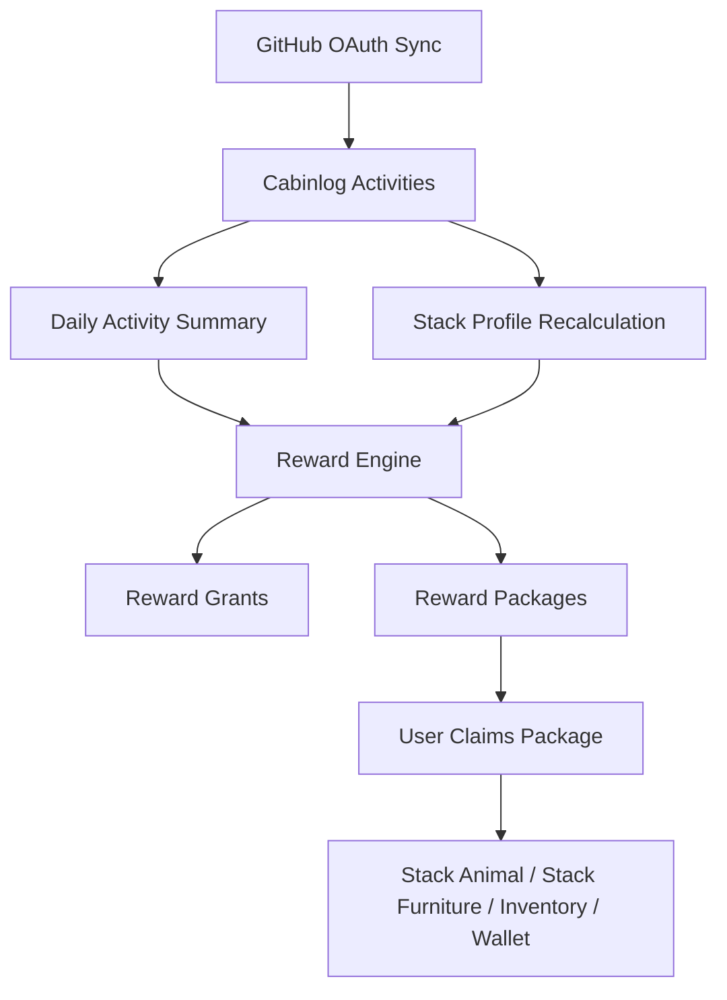

# Cabinlog 게임 디자인 기반

이 문서는 Cabinlog의 첫 번째 백엔드 연동용 게임 디자인 규칙을 정의합니다.
범위는 reward, stack identity, package delivery, sync 결과 처리입니다.
렌더링, 애니메이션, shop, social, ranking, 세부 밸런싱은 현재 범위에서 제외합니다.

## 목표

1. 실제 개발 활동을 보상하되 spam을 유도하지 않는다.
2. 하루에 몰아서 하는 활동보다 매일 꾸준한 활동이 더 좋은 경험이 되게 한다.
3. GitHub stack identity가 바뀌어도 이미 획득한 보상은 제거하지 않는다.
4. Sync 후 "소포가 도착했다"는 명확한 순간을 만들기 위해 reward를 package로 전달한다.
5. 모든 unlock은 grant key로 중복 없이 감사 가능하게 만든다.

## 핵심 루프



## Cabin Presentation

사용자 home은 아이소메트릭 오두막 방입니다. 첫 playable screen은 추상적인
통계 화면이 아니라 실제로 사용할 수 있는 방처럼 느껴져야 합니다.

방 표현 규칙:

1. Reward는 소포로 방 안에 도착합니다.
2. Pet은 방 안에서 idle 상태로 지내고 진화합니다.
3. Furniture는 isometric grid에 배치합니다.
4. GitHub progress는 기본적으로 별도 floating UI가 아니라 방 안의 object로 보여줍니다.
5. Cabin dashboard board가 commit, PR, issue, streak, stack data를 표시합니다.

초기 cabin grid:

| Property | Value |
| --- | --- |
| Room shape | Isometric rectangle |
| Logical size | `8 x 8` floor cells |
| Placement coordinate | `x`, `y`, `z`, `rotation` |
| Wall zones | Back-left wall, back-right wall |
| Floor zones | Floor base, carpet layer, furniture layer |
| Dashboard object | `furniture.dev-board` |

방 내부 dashboard board:

| Board section | Displayed data |
| --- | --- |
| Today | commit count, PR count, issue count, earned coins, daily cap progress |
| Week | active days, activity points, streak |
| Stack | absolute bytes 기준 top 5 languages, current mastery level |
| Leaderboard style | Global ranking이 아니라 방 내부 개인 leaderboard |

Dashboard data는 backend summary에서 받아야 합니다. Room renderer가 reward rule을
직접 계산하면 안 됩니다.

## Activity Reward Points

GitHub raw event가 pet, inventory, cabin state를 직접 변경하면 안 됩니다.
먼저 Cabinlog activity로 정규화하고, 이후 summary와 reward 계산을 거쳐야 합니다.

기본 activity point:

| Activity type | Base points | Coin reward | Daily coin contribution cap | 주요 보상 의도 |
| --- | ---: | ---: | ---: | --- |
| `COMMIT` | 4 | 3 | 45 | 사료와 소량 EXP |
| `PUSH` | 6 | 4 | 24 | 사료와 소량 coin |
| `PULL_REQUEST_OPENED` | 18 | 18 | 54 | coin과 EXP |
| `PULL_REQUEST_MERGED` | 35 | 35 | 70 | coin, EXP, 성장 재료 |
| `ISSUE` | 10 | 10 | 40 | coin과 정리 점수 |
| `REVIEW` | 22 | 22 | 66 | 협업 EXP |
| `RELEASE` | 45 | 50 | 100 | 희귀 재료 |

초기 MVP에서는 `COMMIT`, `PULL_REQUEST_OPENED`, `PULL_REQUEST_MERGED`,
`ISSUE`만 reward 계산에 사용해도 됩니다. 다른 타입은 수집이 생길 때까지
예약 상태로 둡니다.

## Daily Caps

Daily cap은 reward farming을 막고, repository 규모 차이가 큰 사용자 사이의
경험을 안정화합니다.

기본 일일 보상 상한:

| Reward bucket | Daily cap |
| --- | ---: |
| Food | 10 |
| Coins | 150 |
| Pet EXP | 300 |
| Growth material | 3 |
| Package count from daily activity | 1 |

Point를 reward로 변환하는 기본 규칙:

| Metric | Conversion |
| --- | --- |
| Food | `min(10, floor(total_points / 12))` |
| Coins | `min(150, sum(activity_coin_rewards_after_type_caps))` |
| Pet EXP | `min(300, total_points * 4)` |
| Growth material | `min(3, merged_pr_count)` |

권장 일일 coin 예시:

| Daily activity | Raw coins | Coins after caps |
| --- | ---: | ---: |
| Commit 5개 | 15 | 15 |
| Commit 15개 | 45 | 45 |
| PR open 1개 + commit 5개 | 33 | 33 |
| PR merge 2개 + commit 10개 | 100 | 100 |
| Commit, PR, review, release가 많은 heavy day | `150+` | 150 |

Daily reward grant key:

```text
daily:{yyyy-mm-dd}:github-activity
```

하루 중 reward를 다시 계산할 수는 있지만 package 생성은 idempotent해야 합니다.
추후 일일 reward를 누적 보정해야 한다면 package를 중복 생성하지 말고 bucket별
ledger를 따로 둡니다.

## Stack Profile

Stack identity는 absolute volume, ratio, recency를 함께 사용합니다.
Unlock과 evolution은 기본적으로 absolute language volume을 기준으로 합니다.
Ratio는 대표 stack 순서, bonus 가중치, UI 강조에 사용하고 단독 unlock 조건으로 쓰지 않습니다.

이유:

1. ratio만 쓰면 100 percent 단일 언어인 작은 repository가 과대평가됩니다.
2. absolute volume만 쓰면 오래된 비활성 repository가 과대평가됩니다.
3. recency만 쓰면 identity가 너무 쉽게 흔들립니다.

언어별 stack profile 필드:

| Field | Meaning |
| --- | --- |
| `language` | GitHub language name |
| `total_bytes` | synced repository 전체의 해당 언어 byte |
| `ratio` | 전체 language bytes 중 해당 언어 비율 |
| `repository_count` | 해당 언어가 포함된 repository 수 |
| `recent_activity_count` | 해당 언어와 연결된 최근 Cabinlog activity 수 |
| `score` | 계산된 stack score |
| `tier` | score와 threshold 기반 unlock tier |
| `mastery_level` | stack unlock에 사용하는 absolute-volume reward level |
| `calculated_at` | 마지막 계산 시각 |

기본 stack score:

```text
stack_score =
  log10(total_bytes + 1) * 20
  + ratio * 35
  + min(recent_activity_count, 30) * 3
  + min(repository_count, 10) * 2
```

기본 tier threshold:

| Tier | Name | Minimum requirements |
| --- | --- | --- |
| 0 | Unseen | Tier 1 미만 |
| 1 | Familiar | `total_bytes >= 50,000` 또는 `recent_activity_count >= 10` |
| 2 | Practiced | `total_bytes >= 250,000` 그리고 `recent_activity_count >= 5` |
| 3 | Specialist | `total_bytes >= 1,000,000` 그리고 `recent_activity_count >= 15` |

Tier는 미래 sync에서 내려갈 수 있습니다. 하지만 이미 획득한 reward는 제거하지 않습니다.

## Stack Mastery Levels

Stack mastery는 언어별 구체적인 growth ladder입니다. 사용자가 언제 첫 소포를 받고,
이미 보유한 stack reward가 언제 level up되는지 결정합니다. 각 stack reward는
동물 또는 가구 중 하나이며, 둘 다 동시에 지급하지 않습니다.

Mastery level은 언어별 synced language bytes와 activity evidence로 계산합니다.
Ratio만으로 mastery가 열리지는 않습니다.

기본 mastery threshold:

| Level | Name | Absolute volume requirement | Activity requirement | Unlock result |
| --- | --- | ---: | --- | --- |
| 0 | Seed | Level 1 미만 | 없음 | Stack package 없음 |
| 1 | Spark | `50,000` bytes | 또는 최근 activity `10`개 | 첫 stack package와 level 1 reward |
| 2 | Habit | `250,000` bytes | 그리고 최근 activity `5`개 | 보유 중인 stack reward가 level 2로 upgrade |
| 3 | Craft | `1,000,000` bytes | 그리고 최근 activity `15`개 | 보유 중인 stack reward가 level 3으로 upgrade |
| 4 | Mastery | `3,000,000` bytes | 그리고 최근 activity `30`개, active day `7`일 이상 | 보유 중인 stack reward가 level 4로 upgrade |
| 5 | Signature | `10,000,000` bytes | 그리고 최근 activity `75`개, active day `21`일 이상 | 보유 중인 stack reward가 level 5로 upgrade |

최근 activity window:

```text
recent_activity_window_days = 30
```

Active day는 해당 언어의 counted Cabinlog activity가 하나 이상 있는 calendar day입니다.
Active day 조건은 오래된 대형 repository만으로 고단계 진화가 열리는 문제를 막습니다.

Level 계산 규칙:

```text
mastery_level = 모든 조건을 만족하는 가장 높은 level
```

Level 1 예외:

```text
level_1_unlock =
  total_language_bytes >= 50,000
  or recent_activity_count >= 10
```

이 예외는 신규 개발자도 초반 소포를 받을 수 있게 하기 위함입니다. Level 2-5는
더 강한 증거를 요구합니다.

## Stack Unlocks

Stack unlock은 현재 mastery 전환을 기준으로 판단하되, 소유권은 영구입니다.
Python stack reward를 획득한 뒤 Python ratio가 낮아져도 보유 reward는 유지되고,
이미 claim한 최고 level도 내려가지 않습니다. 현재 stack score로 바뀌는 것은
active bonus와 추천 노출 순서 정도로 제한합니다.

언어의 핵심 reward는 level마다 새로 지급하지 않습니다. Level 1에서 owned stack
reward를 만들고, 이후 level은 같은 reward track의 upgrade package를 생성합니다.

기본 stack unlock ladder:

| Mastery level | Package type | Package item | Claim result |
| ---: | --- | --- | --- |
| 1 | Origin package | Language reward seed | Owned stack reward를 level 1로 생성 |
| 2 | Upgrade package | Level 2 upgrade material | Owned stack reward를 level 2로 upgrade |
| 3 | Evolution package | Level 3 evolution material | Owned stack reward를 level 3으로 upgrade/evolve |
| 4 | Mastery package | Level 4 mastery material | Owned stack reward를 level 4로 upgrade |
| 5 | Signature package | Level 5 signature material | Owned stack reward를 level 5로 upgrade |

Stack unlock grant key:

```text
stack_reward_upgrade:{language_slug}:level:{mastery_level}:{reward_key}
```

기본 language reward key:

| Language | Reward type | Main reward key | Level 1 form | Level 2 form | Level 3 form | Level 4 form | Level 5 form |
| --- | --- | --- | --- | --- | --- | --- | --- |
| Python | Animal | `stack.python-serpent` | 작은 serpent companion | 책상 위 idle pose | script-shed evolved form | 은은한 interpreter glow | lab companion form |
| TypeScript | Furniture | `stack.terminal-desk` | 기본 terminal desk | UI monitor attachment | component board upgrade | neon trace lighting | control room workstation |
| Java | Animal | `stack.coffee-sprout` | 작은 coffee sprout | cafe helper form | roasted-bean evolved form | aroma trail aura | cafe master companion |
| Rust | Furniture | `stack.forge-bench` | 기본 forge bench | forge lamp attachment | anvil table upgrade | spark aura lighting | workshop station |
| Go | Animal | `stack.cloud-helper` | 작은 cloud companion | server shelf helper form | deploy-cloud evolved form | wind trail aura | infra master companion |

Reward key는 Cabinlog 자체 개념입니다. 특정 기술이나 프로젝트의 상표 캐릭터,
공식 mascot을 그대로 복제하면 안 됩니다.

Stack-themed reward catalog:

| Stack | Reward type | Reward concept | Room visual identity | Food/material concept |
| --- | --- | --- | --- | --- |
| Python | Animal | 유연한 serpent-like companion | 종이와 작은 램프가 있는 차분한 lab corner | Warm byte biscuit, shed scale |
| TypeScript | Furniture | UI monitor와 component board가 붙는 terminal desk | Panel과 status light가 있는 밝은 workstation | Signal candy, typed core |
| Java | Animal | Coffee sprout companion | Brewing tool이 있는 따뜻한 cafe desk | Roasted bean, warm cup |
| Rust | Furniture | Lamp, anvil table, metal rack이 붙는 forge bench | Spark와 gear가 있는 workshop corner | Gear treat, forge core |
| Go | Animal | Cloud helper companion | Cloud/server motif가 있는 가벼운 infra corner | Cloud puff, deploy token |
| JavaScript | Furniture | Browser console table with script poster | Yellow accent light가 있는 playful scripting corner | Spark snack, event loop bead |
| C/C++ | Furniture | Circuit bench with compiler cabinet | Board와 tool이 있는 low-level hardware corner | Bit chip, linker plate |
| C# | Furniture | Studio desk with blueprint panel | Polished panel 중심의 clean toolsmith corner | Sharp candy, crystal shard |
| Kotlin | Animal | Night fox companion | Compact mobile studio corner | Moon jelly, coroutine thread |
| Swift | Animal | Swiftlet light companion | 밝은 app studio corner | Feather cookie, app icon gem |
| PHP | Animal | Pantry blob companion | Retro web cabin corner | Purple jelly, request token |
| Ruby | Animal | Gem sprite companion | Red gem accent가 있는 cozy craft corner | Gem candy, polished shard |
| Shell | Furniture | Command crate with log board | Crate와 cable이 있는 utility corner | Command chip, shell fragment |
| SQL | Furniture | Data cabinet with query table | Drawer 중심의 organized archive corner | Data grain, index tag |
| Docker | Furniture | Container shelf with deploy crate | Label box가 있는 shipping/storage corner | Container cracker, image seal |

초기 MVP는 Python, TypeScript, Java, Rust, Go를 먼저 구현합니다.
나머지 stack row는 future reward key와 visual direction을 정의합니다.

## Animal Reward Evolution

Animal reward는 stack reward type 중 하나입니다. Level 1에서 unlock되고,
같은 stack reward가 upgrade될 때 진화합니다. Stack ratio가 낮아져도 animal은
사라지거나 downgrade되지 않습니다.

Animal lifecycle:

| Stage | Name | How obtained | Backend state |
| ---: | --- | --- | --- |
| 0 | Package item | Level 1 package pending | Package item only |
| 1 | Companion | Level 1 package claim | `user_stack_rewards.stage = 1`, `stack_reward_level = 1` |
| 2 | Skilled companion | Level 3 upgrade claim + growth requirement 충족 | `user_stack_rewards.stage = 2`, `stack_reward_level = 3` |
| 3 | Master companion | Level 4 upgrade claim + growth requirement 충족 | `user_stack_rewards.stage = 3`, `stack_reward_level = 4` |

Animal growth requirement:

| Evolution | Required stack mastery | Required pet EXP | Required material |
| --- | ---: | ---: | --- |
| Stage 1 -> 2 | Level 3 | `1,200` | language evolution material `1`개 |
| Stage 2 -> 3 | Level 4 | `4,000` | language evolution material `3`개 |

Animal EXP는 raw GitHub event에서 직접 들어오지 않고 daily activity package로 지급합니다.
Reward engine은 기본적으로 현재 featured animal을 대상으로 EXP를 지급합니다.
Featured animal이 없다면 account EXP로 보관하거나, 이후 가장 높은 stack score animal에
적용할 수 있습니다.

Upgrade package 동작:

1. 사용자가 stack reward를 보유하고 EXP/material 조건을 충족하면 claim 시 즉시 upgrade/evolve할 수 있습니다.
2. EXP/material 조건을 충족하지 못하면 claim은 upgrade material을 기록하고 visible reward는 유지합니다.
3. 이후 별도 evolution API 또는 다음 claim에서 조건 충족 시 stored material을 소비합니다.

## Furniture Reward Progression

Furniture reward는 다른 stack reward type입니다. 높은 mastery level은 기존 reward
track에 연결된 language-themed furniture를 upgrade합니다.

Furniture tier:

| Tier | Unlock source | Purpose |
| ---: | --- | --- |
| 1 | Stack mastery level 2 | 기존 stack reward가 기본 cabin object를 얻음 |
| 2 | Stack mastery level 3 | 기존 object가 더 강한 workstation theme으로 upgrade |
| 3 | Stack mastery level 5 | 기존 object가 signature room set으로 확장 |

Furniture ownership은 영구입니다. Sync 후 mastery level이 내려가도 owned furniture는
downgrade되지 않고 계속 사용할 수 있습니다. 다만 현재 stack bonus decoration은 추천
순서에서 내려갈 수 있습니다.

## Shop Catalog

상점은 cabin customization과 pet care item을 판매합니다. 구매 재화는 일일 활동으로
얻는 coin을 사용합니다. Stack mastery item은 대부분 package로 획득해야 하며,
상점에서 직접 살 수 없게 해야 개발자 정체성이 earned reward처럼 느껴집니다.

Coin economy:

| Economy setting | Value |
| --- | ---: |
| Daily coin cap | 150 |
| Expected light day income | 15-40 |
| Expected normal day income | 50-100 |
| Expected heavy day income | 120-150 |
| Early wallpaper target price | 180-300 |
| Early furniture target price | 250-600 |
| Premium non-paid rare target price | 1,200-2,000 |

초기 shop category:

| Category | Example item keys | Price range | Notes |
| --- | --- | ---: | --- |
| Wallpaper | `wallpaper.pine`, `wallpaper.night-grid`, `wallpaper.cafe-plaster` | 180-450 | 벽 texture/color 변경 |
| Floor design | `floor.oak`, `floor.stone-tile`, `floor.dark-grid` | 180-450 | 기본 바닥 변경 |
| Carpet/rug | `rug.green-check`, `rug.terminal-mat`, `rug.coffee-round` | 120-350 | 바닥 위 layer |
| Generic furniture | `furniture.small-table`, `furniture.bookcase`, `furniture.plant-pot` | 250-700 | stack-gated 아님 |
| Dashboard boards | `furniture.dev-board`, `furniture.issue-board`, `furniture.stack-board` | 300-900 | GitHub summary 표시 |
| Pet clothes | `petwear.ribbon`, `petwear.tiny-hoodie`, `petwear.work-apron` | 250-800 | Cosmetic only |
| Food | `food.byte-biscuit`, `food.commit-cookie`, `food.review-tea` | 20-80 | Affection 또는 소량 EXP |
| Growth support | `material.training-note`, `material.polish-kit` | 200-500 | Pet growth 보조, stack mastery 대체 불가 |
| Lighting | `light.desk-lamp`, `light.neon-line`, `light.candle-set` | 180-600 | Cabin ambience |

Shop constraints:

1. 상점은 direct stack mastery level을 판매하지 않습니다.
2. 상점은 generic food/material은 팔 수 있지만 absolute stack threshold를 우회할 수 없습니다.
3. Stack-themed cosmetic은 해당 stack reward를 unlock한 뒤에만 상점에 노출할 수 있습니다.
4. Coin sink는 대부분 cosmetic이어야 하며, 접속하지 못한 날을 과하게 처벌하면 안 됩니다.

## Daily Reward Levels

Daily reward는 하루 단위로 cap이 있지만 streak quality level을 가질 수 있습니다.
이는 평범한 일일 활동도 보상하면서, 하루에 몰아서 한 활동이 경제를 망치지 않게 합니다.

Daily activity level:

| Daily level | Point range | Package contents before caps |
| ---: | --- | --- |
| 0 | `0` | Daily package 없음 |
| 1 | `1-29` | Small food + small coin |
| 2 | `30-79` | Food + coin + pet EXP |
| 3 | `80-149` | More food + coin + pet EXP |
| 4 | `150+` | Capped food/coin/EXP + growth material chance |

Daily level은 daily cap을 우회하지 않습니다. Package 문구, 연출, rare material
등장 가능성에만 영향을 줍니다.

권장 daily grant key:

```text
daily:{yyyy-mm-dd}:github-activity:level:{daily_level}
daily_topup:{yyyy-mm-dd}:{bucket}
```

MVP에서는 첫 번째 key만 사용합니다. 하루에 여러 번 sync한 뒤 package upgrade가
필요해질 때만 `daily_topup`을 추가합니다.

## Package Delivery

Reward는 소포로 도착해야 합니다. Sync는 pending package를 만들고,
최종 owned game object는 사용자가 claim할 때 생성합니다. 단, 중복 방지용
immutable grant record는 sync 중 생성할 수 있습니다.

Package status:

| Status | Meaning |
| --- | --- |
| `PENDING` | 생성되었고 claim 대기 중 |
| `CLAIMED` | 사용자가 claim 완료 |
| `EXPIRED` | 미래 time-limited reward용 예약 |

Package source:

| Source | Meaning |
| --- | --- |
| `GITHUB_SYNC` | Stack unlock 또는 sync milestone |
| `DAILY_REWARD` | Daily activity reward package |
| `ACHIEVEMENT` | 미래 achievement package |

권장 package title:

| Source | Title pattern |
| --- | --- |
| Stack origin package | `{Language} origin package` |
| Stack upgrade package | `{Language} level {level} upgrade package` |
| Stack evolution package | `{Language} evolution package` |
| Daily activity | `Today's developer care package` |

Claim 동작:

1. package ownership과 `PENDING` 상태를 검증한다.
2. owned pet, inventory item, wallet balance, material balance 중 필요한 것을 생성한다.
3. package status를 `CLAIMED`로 바꾼다.
4. 사용자 관점에서 idempotent해야 하며, 두 번째 claim 시 reward가 중복 지급되면 안 된다.

## Persistence Boundary

다음 backend table을 우선 권장합니다.

```text
user_stack_profiles
- id
- user_id
- language
- total_bytes
- ratio
- repository_count
- recent_activity_count
- active_days_30d
- score
- tier
- mastery_level
- calculated_at
- created_at
- updated_at
```

```text
reward_grants
- id
- user_id
- grant_key
- source
- created_at
```

```text
reward_packages
- id
- user_id
- source
- status
- title
- description
- created_at
- claimed_at
- metadata
```

```text
reward_package_items
- id
- package_id
- item_type
- item_key
- quantity
- metadata
```

이후 table:

```text
user_wallets
user_stack_rewards
user_inventory
cabin_items
```

초기 `user_stack_rewards` 형태:

```text
user_stack_rewards
- id
- user_id
- reward_key
- reward_type
- source_language
- stage
- stack_reward_level
- exp
- is_featured
- created_at
- updated_at
```

초기 `user_inventory` 형태:

```text
user_inventory
- id
- user_id
- item_type
- item_key
- quantity
- created_at
- updated_at
```

Package 생성과 claim semantics가 안정화되기 전에는 최종 pet/cabin mutation을
구현하지 않습니다.

## Sync Outcome Rules

`POST /api/v1/github/sync` 또는 OAuth callback sync 이후:

1. GitHub repository와 activity를 저장/갱신한다.
2. Stack profile을 재계산한다.
3. 누락된 stack unlock grant를 생성한다.
4. 새 grant에 대한 pending package를 생성한다.
5. 현재 일일 reward package를 생성하거나 갱신한다.
6. Reward API가 생기면 sync response에 새 package count를 포함한다.

현재 구현된 sync endpoint는 1번까지만 수행합니다. 2-6번이 다음 game foundation
milestone입니다.

## Ownership Rules

1. 획득한 pet과 furniture는 영구 보유입니다.
2. 현재 stack tier는 내려갈 수 있습니다.
3. 내려간 tier는 현재 bonus, 추천 노출, 미래 eligibility에만 영향을 줍니다.
   이미 보유한 reward는 회수하지 않습니다.
4. 중복 package 생성은 `reward_grants.grant_key`로 막습니다.
5. Package claim은 package creation과 분리합니다.

## MVP Milestones

1. Repository language bytes와 최근 activity 기반 stack profile 계산
2. Reward grant ledger와 package table
3. Sync 중 stack unlock package 생성
4. Package list와 claim API
5. Daily activity summary와 capped daily reward package
6. Claim 시 pet/inventory/wallet 반영
