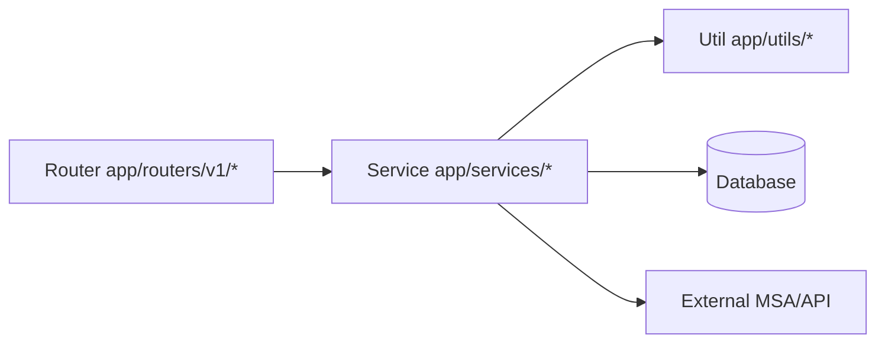
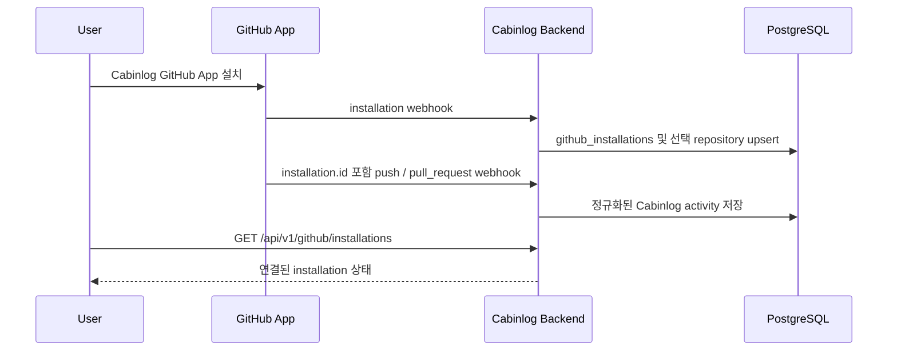

# 백엔드 빠른 가이드

이 문서는 `src/backend` 작업자를 위한 최소 참조 가이드입니다.
전체 엔지니어링 규칙은 `src/backend/BACKEND.md`를 따르세요.
백엔드 테스트 엔지니어링 규칙은 `src/backend/TEST.md`를 따르세요.

## 1) 핵심 규칙

- 레이어링 패턴: `Router -> Service -> Util/DB/MSA`
- 환경 변수는 `app/core/config/settings.py`의 `SETTINGS`를 통해 접근
- 스키마/모델이 바뀌면 Alembic 마이그레이션 업데이트 필수
- RBAC는 `app/deps.py` 의존성(예: admin 전용 가드)으로 강제
- `LOGIN_ENABLED=false` 부트스트랩 모드에서는 bootstrap 사용자를 `admin`으로 프로비저닝/승격
- `PASSWORD_AUTH_ENABLED=false`는 OAuth 로그인은 유지하면서 레거시 이메일/비밀번호 진입점을 비활성화
- 시작 시 백엔드는 현재 `DATABASE_URL`에 대해 Alembic `upgrade head`만 수행(다운그레이드 경로 없음)
- API 키는 누적 사용량(`request_count`)과 선택적 만료(`expires_at`)를 추적
- 실시간 SSE 스트림은 `/api/v1/events/stream`에서 제공되며 heartbeat 및 Redis Pub/Sub fan-out을 사용
- 비동기 백그라운드 작업은 공용 Redis 큐 워커 코어(`app/core/task_queue/worker.py`)와 도메인/서비스 어댑터(예: `app/core/task_queue/services/mail.py`)로 처리
- 인증 메일 템플릿은 요청 `Accept-Language`(`en`/`ko`)를 기준으로 로컬라이즈되며 메일 큐 payload까지 전달됨
- 인증 메일 언어 결정 시 `X-App-Language` 헤더를 `Accept-Language`보다 우선 적용
- 모든 HTTP 응답은 요청 상관관계 헤더(`X-Request-ID`, `X-Trace-ID`)를 포함하고 백엔드 로그도 같은 컨텍스트 값을 포함
- `METRICS_ENABLED=true`일 때 Prometheus metrics를 `/metrics`에서 제공
- `TRACING_ENABLED=true`일 때 OpenTelemetry tracing을 OTLP로 내보낼 수 있음

## 1.1) 백엔드 흐름



## 2) 설정

```bash
cd src/backend
uv sync
```

## 3) 서버 실행

```bash
cd src/backend
uv run uvicorn app.main:app --reload --port 8000
```

API 문서:
- `http://localhost:8000/docs`

Cabinlog 인증 기본값:
- `PASSWORD_AUTH_ENABLED=true`가 아니면 비밀번호 기반 가입/로그인 엔드포인트는 비활성화됩니다.
- 기본 OAuth provider 목록은 GitHub만 포함합니다(`OAUTH_ALLOWED_PROVIDERS=github`).
- `OAUTH_ENABLED=true`는 `OAUTH_GITHUB_CLIENT_ID`, `OAUTH_GITHUB_CLIENT_SECRET` 설정 후 사용하세요.
- 백엔드 단독 OAuth 검증에는 `OAUTH_CALLBACK_RESPONSE_MODE=json`을 사용하세요. callback에서 token과 연결된 GitHub profile을 바로 반환합니다.

GitHub 백엔드 기반:
- `GET /api/v1/github/me`는 OAuth 로그인 중 연결된 현재 사용자의 GitHub profile을 반환합니다.
- `GET /api/v1/github/app/install-url`은 설정된 GitHub App installation URL을 반환합니다.
- `GET /api/v1/github/repositories`는 OAuth 로그인 중 수집된 repository/language snapshot을 반환합니다.
- `GET /api/v1/github/installations`는 현재 사용자와 연결된 GitHub App installation 상태를 반환합니다.
- `GET /api/v1/github/stack-summary`는 수집된 repository 전체의 언어 byte 총합과 비율을 반환합니다.
- `POST /api/v1/webhooks/github`는 `GITHUB_WEBHOOK_SECRET`으로 서명 검증된 GitHub webhook을 수신합니다.
- GitHub App `installation`, `installation_repositories` webhook은 installation/repository selection 상태를 저장합니다.
- Activity webhook은 GitHub App `installation.id`로 사용자/repository 귀속을 우선 처리하고, 없으면 sender의 연결된 GitHub profile로 fallback합니다.
- 초기 activity 정규화는 `push`, `pull_request` 이벤트를 지원하고 Cabinlog activity로 저장합니다.
- `GET /api/v1/github/activities`는 현재 사용자의 저장된 GitHub 기반 activity를 반환합니다.
- 지원하지 않는 webhook 이벤트는 ignored 상태로 응답하며 게임 activity를 생성하지 않습니다.

GitHub App installation 흐름:



백엔드 단독 OAuth 확인:
1. `APP_BASE_URL=http://localhost:8000`, `OAUTH_CALLBACK_RESPONSE_MODE=json`을 설정합니다.
2. 브라우저에서 `/api/v1/auth/oauth/github/start`를 엽니다.
3. GitHub 승인 후 callback이 `access_token`, `refresh_token`, `user`, `github_profile` JSON을 반환합니다.
4. 반환된 `access_token`을 bearer token으로 사용해 `/api/v1/github/me`, `/api/v1/github/app/install-url`, `/api/v1/github/installations`, `/api/v1/github/repositories`, `/api/v1/github/stack-summary`, `/api/v1/github/activities`를 호출합니다.

GitHub App 로컬 설정:
- `GITHUB_APP_SLUG`에는 GitHub App URL의 slug를 설정합니다(예: `cabinlog-dev`).
- `GITHUB_WEBHOOK_SECRET`은 GitHub App webhook 설정에 입력한 secret과 같은 값으로 설정합니다.
- GitHub App Webhook URL은 `${APP_BASE_URL}/api/v1/webhooks/github`로 설정합니다.
- GitHub App webhook event는 `installation`, `installation_repositories`, `push`, `pull_request`를 구독합니다.

Prometheus metrics:
- `http://localhost:8000/metrics`

Health checks:
- `http://localhost:8000/health/live`
- `http://localhost:8000/health/ready`

OpenTelemetry tracing:
- `TRACING_ENABLED=true` 설정
- `OTEL_EXPORTER_OTLP_ENDPOINT`를 collector endpoint로 설정(예: `http://localhost:4317`)

로컬 Docker observability stack:

```bash
cd docker
docker compose --profile observability up -d tempo otel-collector prometheus grafana
```

기본 Docker 실행에서는 observability 서비스를 제외합니다. Tempo, OpenTelemetry Collector, Prometheus, Grafana가 필요할 때 `--profile observability`를 사용합니다.

백엔드까지 포함한 전체 compose stack을 실행할 때:

```bash
cd docker
docker compose --profile observability up -d
```

백엔드도 같은 compose 파일로 실행할 때는 다음 값을 사용:

```env
TRACING_ENABLED=true
OTEL_EXPORTER_OTLP_ENDPOINT=http://otel-collector:4317
```

Grafana:
- `http://localhost:3000` (`admin` / `admin`)
- 자동 등록 dashboard: `B4FastAPI / FastAPI Overview`

Prometheus:
- `http://localhost:9090`

로컬 Prometheus 설정은 호스트 머신에서 실행 중인 백엔드를 수집합니다:
- target: `host.docker.internal:8000`

백엔드도 compose `app` 서비스로 실행할 때는 Prometheus target을 `app:8000`으로 변경합니다.

Trace 흐름:
- FastAPI app -> OpenTelemetry Collector -> Tempo -> Grafana

Metrics 흐름:
- FastAPI `/metrics` -> Prometheus -> Grafana

자동 등록되는 FastAPI dashboard 항목:
- backend target 상태
- request rate
- 5xx error ratio
- latency p95
- endpoint request rate와 endpoint p95 latency

## 4) 린트 / 포맷 (Ruff)

```bash
cd src/backend
uv run ruff check . --fix
uv run ruff format .
```

체크 전용 모드:

```bash
cd src/backend
uv run ruff check .
uv run ruff format . --check
```

## 5) DB 마이그레이션 (Alembic)

모델/스키마 변경 후:

```bash
cd src/backend
uv run alembic revision --autogenerate -m "describe-schema-change"
uv run alembic upgrade head
```

롤백 예시:

```bash
cd src/backend
uv run alembic downgrade -1
```

## 6) 커밋 전 체크리스트

```bash
cd src/backend
uv run ruff check . --fix
uv run ruff format .
```

추가 확인:
- DB 변경 시 Alembic revision/upgrade 확인
- 동작/규칙 변경 시 `AGENTS.md`, 루트 `README.md`, `src/backend/BACKEND.md` 동기화

## 7) 마이그레이션 및 데이터 운영

- 마이그레이션 실패 대응: `src/backend/MIGRATION_ROLLFORWARD.md`
- DB 백업/복구 런북: `src/backend/DB_BACKUP_RESTORE.md`
- Alembic revision 규칙:
1. `revision` 형식: `NNNN_snake_case`
2. 최대 길이: `32`

## 8) 테스트 (도메인/API 구조)

- 테스트는 API 도메인 단위로 `tests/api/v1/<domain>/` 아래 구성
- 현재 시작 레이아웃:
1. `tests/api/v1/auth/test_auth_api.py`
2. `tests/api/v1/api_key/test_api_key_api.py`
3. `tests/api/v1/events/test_events_api.py`

테스트 실행:

```bash
cd src/backend
uv run pytest
```
