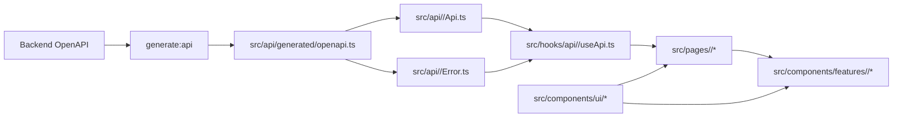

# 프론트엔드 엔지니어링 가이드

이 프로젝트는 에이전트 중심 코딩 패턴에 맞춰 최적화되어 있으며, 사람과 에이전트 모두 일관되고 높은 품질의 결과를 유지하기 위해 동일한 규칙을 따라야 합니다.

## 0) 범위와 우선순위

- 범위: `src/frontend` 하위 전체
- 프론트엔드 작업 전 읽기 순서:

1. 루트 `AGENTS.md`
2. 이 문서 (`src/frontend/FRONTEND.md`)
3. 테스트 추가/변경 시 테스트 가이드 (`src/frontend/TEST.md`)

- 충돌 시 우선순위:

1. 루트 `AGENTS.md`
2. 이 문서
3. 로컬 파일 주석 및 기존 코드 스타일

## 0.1) 프론트엔드 프로젝트 구조

```text
src/frontend/
  src/
    api/          # generated + domain API/error
    hooks/        # api hooks + app hooks
      connectivity/ # 데스크톱 서버 readiness/재연결 라이프사이클
      realtime/   # 스트림 구독 라이프사이클 훅 (비 API)
        core/     # 공통 스트림 라이프사이클/재연결 훅
        <domain>/ # 도메인별 스트림 핸들러 (apiKey, ...)
    pages/        # page-group based (login/settings/main)
    components/
      ui/         # reusable UI components (category folders)
      features/   # domain-specific components
      layout/     # app shell/navigation
    styles/
    utils/
  scripts/
  public/
  src-tauri/    # 선택형 Tauri 데스크톱 셸; 브라우저 프론트엔드도 계속 지원
```

## 0.2) 프론트엔드 흐름과 결합 구조



## 0.3) 프론트엔드 런타임 루프

프론트엔드 동작을 추가하거나 변경할 때 다음 루프를 기본 확인 항목으로 사용합니다. 해당하지 않는 루프는 “해당 없음”으로 볼 수 있지만, 커밋 전에 이유가 명확해야 합니다.

### 0.3.1) API State 루프

사용자 주도 API 동작은 다음 경로를 따라야 합니다.

1. 페이지가 도메인 hook 호출과 사용자 action 처리를 소유
2. 도메인 hook이 도메인 API wrapper 호출
3. 도메인 API wrapper가 생성된 OpenAPI 타입과 도메인 에러 매핑 사용
4. hook이 loading, success, error 상태를 page용으로 정규화
5. page가 state와 action을 feature component에 props로 전달
6. UI는 feature component 내부에 API state를 중복하지 않고 hook state에서 갱신

페이지와 feature component는 `src/api/*`를 직접 import하거나 도메인 hook을 우회하면 안 됩니다.

### 0.3.2) Realtime Refresh 루프

백엔드 도메인 이벤트가 화면 상태를 갱신해야 한다면 realtime refresh 루프를 사용합니다.

1. 도메인 realtime hook이 shared realtime core를 통해 구독
2. 도메인 이벤트 parser가 알려진 event type을 검증하고 dispatch
3. 영향받은 API state는 도메인 소유 위치 한 곳에서 refetch, invalidate, update
4. page와 feature component는 갱신된 hook state에서 rerender

재연결/backoff 동작은 `src/hooks/realtime/core/*`에 두고, 도메인 이벤트 처리는 `src/hooks/realtime/<domain>/*`에 둡니다.

### 0.3.3) Desktop Connectivity Recovery 루프

패키징된 데스크톱 동작은 다음 복구 루프를 따라야 합니다.

1. connectivity hook이 `/health/ready`를 확인하고 desktop server readiness 추적
2. readiness가 유효하지 않은 동안 API와 realtime 작업 중단
3. 수동 재시도와 backoff 복구는 disconnected UI를 안정적으로 유지
4. 복구 후 stale API/realtime state를 갱신한 뒤 정상 상호작용 재개

브라우저 런타임에서는 desktop readiness polling을 시작하면 안 되며, desktop outage가 local user/session state를 지우면 안 됩니다.

### 0.3.4) UI Composition 루프

시각/상호작용 변경은 새 markup, component, CSS를 추가하기 전에 다음 루프를 따라야 합니다.

1. `src/components/ui/*`, `src/components/layout/*`, 기존 feature component에서 재사용 가능한 control 또는 pattern 확인
2. 재사용 가능한 UI라면 shared component를 먼저 구현/확장하고, 해당하는 경우 `src/components/ui/index.ts`에서 export
3. `src/styles/app.css`의 shared style을 사용하고, 반복될 가능성이 있는 style은 이 파일에 reusable class로 추가
4. feature/page component는 composition, state wiring, 도메인별 label에 집중
5. compact control은 stable dimension, button 내부 text fit, text/icon 간격 일관성 확인
6. pagination 같은 collection control은 shared button/control style, 안정적인 item size, disabled/current state, label 또는 page number 변화 시 layout shift 방지를 확인
7. layout 또는 text fit에 영향을 주는 변경은 커밋 전 mobile/desktop 폭에서 결과 확인

명시된 예외가 없다면 일회성 button spacing, inline pagination style, page-local control CSS, 중복 component variant를 피합니다.

## 1) 포맷팅과 린팅

- 프론트 코드 포맷의 기준은 Prettier입니다.
- 커밋 전 필수 (`src/frontend`에서 실행):

1. `npm run format`
2. `npm run format:check`

- 프론트 VS Code 설정 파일이 있다면 포맷/임포트 정렬을 일치시켜야 합니다.

## 2) TypeScript 규칙 (Strict)

- 모든 프론트 코드는 TypeScript 필수
- `tsconfig.json`의 strict 모드는 반드시 유지
- 안전한 대안이 없는 경우를 제외하고 `any` 사용 지양
- 생성된 OpenAPI 스키마의 정밀한 도메인 타입 우선 사용
- 공개 유틸, 훅, API 래퍼는 입력/출력 타입을 명시적으로 선언

## 2.1) 타입 선언 컨벤션

- 이 프로젝트의 네이밍/접근 방식:

1. Strict TypeScript
2. 명시적 타이핑
3. 계약 우선 타이핑 (OpenAPI 생성 타입 우선)

- 선언 규칙:

1. 기본적으로 `type` alias 우선
2. 확장/구현 의미가 명확할 때만 `interface` 사용
3. Props 타입은 `XxxProps` 네이밍 사용
4. API 관련 로컬 타입은 `Request`, `Response`, `ErrorDetail` 같은 명확한 suffix 사용
5. 도메인 로컬 타입은 도메인 모듈 근처에 유지하고, 전역 타입 dumping 금지
6. 명확한 사유와 fallback 계획 없이 `any` 도입 금지

## 3) API 계약 규칙 (`generate:api`, 필수)

- 백엔드 OpenAPI는 API 계약의 단일 기준입니다.
- 필수 생성 소스:

1. `http://localhost:8000/openapi.json`

- 필수 생성 파일:

1. `src/api/generated/openapi.ts`

- 규칙:

1. API/hook/page 레이어에서 `src/api/generated/openapi.ts` 타입을 사용
2. OpenAPI 기반 엔드포인트에 대해 중복된 수기 계약 타입 유지 금지
3. 백엔드 API 스키마가 바뀌면 API 호출부 수정 전에 `npm run generate:api` 실행
4. `npm run build`는 기본적으로 서버 비의존(OpenAPI fetch 없음)
5. 선택적 API 갱신 + 빌드는 `npm run build:sync` 사용
6. 백엔드 기준 엄격 OpenAPI 갱신이 필요하면 `npm run build:strict`(또는 `npm run generate:api`) 사용

## 4) 도메인 API/Error/Hook 규칙 (1:1:1, 필수)

- 도메인 모듈은 `src/api/<domain>/` 아래에 공존해야 합니다.
- 각 도메인은 다음을 포함해야 합니다:

1. `<domain>Api.ts`
2. `<domain>Error.ts`
3. `src/hooks/api/<domain>/use<Domain>Api.ts`

- 예시:

1. Auth router 도메인 -> `src/api/auth/authApi.ts` + `src/api/auth/authError.ts` + `src/hooks/api/auth/useAuthApi.ts`
2. API key router 도메인 -> `src/api/apiKey/apiKeyApi.ts` + `src/api/apiKey/apiKeyError.ts` + `src/hooks/api/apiKey/useApiKeyApi.ts`
3. Events router 도메인 -> `src/api/events/eventsApi.ts` + `src/api/events/eventsError.ts` + `src/hooks/api/events/useEventsApi.ts`

- 신규 백엔드 router/domain이 추가되면 같은 작업 사이클에서 프론트에도 1:1:1 세트를 반드시 추가
- 도메인 에러 파싱/매핑을 `src/utils`에 두지 말고 각 도메인 API 폴더 내부에 유지
- API 인터페이스 체인은 필수:

1. `generated_api_schema`
2. `api/<domain>`
3. `hooks/api/<domain>`
4. 실제 사용처 (`pages/components`)

- 실시간 스트림 참고:

1. 스트림 인증이 bearer token 기반이면 native `EventSource`로 인증 헤더를 보낼 수 없습니다.
2. 인증 스트림은 도메인 API 레이어에서 `fetch` 스트리밍 방식으로 구현합니다.
3. 재연결/backoff 정책은 `src/hooks/realtime/core/*`에서 처리합니다.
4. 도메인 이벤트 파싱/디스패치는 `src/hooks/realtime/<domain>/*`에서 처리합니다.

- 데스크톱 연결 참고:

1. 패키징된 Tauri 런타임의 readiness는 `/health/ready`로 확인하며 `navigator.onLine`은 보조 신호로만 사용합니다.
2. 데스크톱 재연결/backoff 책임은 `src/hooks/connectivity/*`에 둡니다.
3. 브라우저 런타임에서는 데스크톱 readiness polling을 시작하면 안 됩니다.
4. 데스크톱 readiness가 유효하지 않은 동안 실시간 구독을 중단하고 복구 후 다시 시작해야 합니다.
5. `/config` 데이터가 없으면 fail-closed로 처리하며, 명시적인 `login_enabled=false` 응답만 로그인 비활성화 라우트를 열 수 있습니다.
6. 데스크톱 연결 끊김 상태는 페이지 전체 overlay가 아니라 앱 Nav 프로필 또는 standalone/public Nav 도구 영역 옆에 배치합니다.
7. 앱 및 public Nav는 대칭 외곽 column과 고정 compact 상태 폭을 사용해 상태 문구 변경 시 중앙 제목이 이동하지 않도록 합니다.
8. 수동 재시도 UI는 순간적인 로딩 상태를 깜빡이지 않아야 하며, 연결 끊김 문구를 유지하고 무거운 로딩 표시는 짧은 지연 뒤에만 보여줍니다.
9. 패키징된 데스크톱 연결 상태가 `online`이 아니면 프로필 메뉴 로그아웃을 비활성화하며, 서버 장애 중 로컬 사용자 상태를 지우거나 `/login`으로 이동하면 안 됩니다.

- `pages/components`는 `src/api/*`를 직접 import하면 안 되고 도메인 훅만 소비해야 합니다.
- API 훅은 `src/hooks/api/<domain>/*` 아래에 배치해야 합니다.
- 비 API 훅(state/session/i18n/feature/auth-context)은 `src/hooks/api/*` 바깥에 유지
- page/hook 책임 규칙:

1. 도메인 훅 호출 책임은 page 레이어가 가짐
2. 페이지는 실제 페이지 그룹 단위(예: `pages/login`, `pages/settings`, `pages/main`)로 구성
3. 도메인 feature 컴포넌트는 상태/액션을 props로 전달받고 도메인 API 훅을 직접 호출하지 않음
4. 컴포넌트는 필요 시 비도메인 훅(UI state/i18n 등)을 사용할 수 있음

## 5) 에러 코드 처리 규칙

- 에러 처리는 백엔드 정의 에러 코드와 생성된 스키마 타입을 기준으로 해야 합니다.
- `Record<ErrorCode, ...>` 스타일의 완전한 코드-메시지 매핑 유지
- 신규 백엔드 에러 코드가 생기면 프론트 매핑이 명시 처리될 때까지 컴파일 타임에 fail-fast 되어야 함
- 미지/비스키마 에러는 안전한 fallback 메시지 경로로 정규화하되, 알려진 코드 분기는 유지

## 6) 컴포넌트와 스타일 규칙 (Showcase 우선)

- 공유 UI 컴포넌트 우선, 그다음 feature 컴포넌트, 마지막으로 page 조합 순서로 사용
- 컴포넌트 디렉터리 책임:

1. `src/components/ui/*`: 저수준 재사용 프리미티브
2. `src/components/layout/*`: 앱 셸/내비게이션/레이아웃 수준 컴포넌트
3. `src/components/features/<domain>/*`: 도메인 특화 컴포넌트

- 필수 컴포넌트 우선순위:

1. `src/components/ui/*`
2. 조합 재사용이 필요한 경우 `src/components/layout/*`
3. 도메인 결합 조합은 `src/components/features/<domain>/*`
4. `src/pages/*` (조합 중심, raw markup 최소화)

- 새 컴포넌트 생성 전:

1. 공유 UI에 동등 컴포넌트가 이미 있는지 확인
2. `ui`(재사용)인지 `features/<domain>`(도메인 전용)인지 분류
3. 페이지 인라인 마크업이 아닌 컴포넌트 단위로 생성
4. 신규 재사용 UI 컴포넌트를 추가했다면 `src/pages/main/ShowCasePage.tsx`에 사용 예시 등록

- UI 폴더 규칙:

1. UI 컴포넌트는 성격별 카테고리 폴더(`buttons`, `cards`, `dropdowns`, `lists`, `inputs`, `switches`, `toggles` 등)에 배치
2. `src/components/ui/index.ts`를 export 진입점으로 유지하고, UI 파일 추가/이동 시 반드시 업데이트

- 스타일 규칙:

1. 모든 프론트 CSS는 `src/styles/app.css`에서 관리
2. 문서화된 예외 승인 없이는 페이지/컴포넌트별 별도 CSS 파일 추가 금지
3. 재사용 클래스/컴포넌트 스타일로 추출 가능한 경우 일회성 중복 스타일 지양
4. 스크롤바는 `src/styles/app.css`의 글로벌 규칙을 따라 스크롤 가능한 모든 컨테이너의 스타일 일관성 유지

## 7) 빌드 및 런타임 참고

- 의존성 설치:

1. `npm ci` (lockfile 갱신 의도가 있을 때만 `npm install`)

- 로컬 개발:

1. `npm run dev`
2. 선택형 데스크톱 셸은 `npm run tauri:dev` 사용(Rust 필요)

- 프로덕션 빌드:

1. `npm run build`
2. `npm run build:sync` (선택적 백엔드 OpenAPI 갱신)
3. `npm run build:strict` (백엔드 OpenAPI 엔드포인트 필수)
4. `npm run build:desktop`은 FastAPI 복사 없이 공용 asset만 빌드

- 빌드 파이프라인에는 `scripts/copy-to-backend.mjs`를 통한 프론트 아티팩트의 백엔드 static 경로 복사가 포함됩니다.

## 8) 국제화(i18n) 규칙 (필수)

- 사용자에게 보이는 모든 텍스트는 i18n 키로 관리해야 합니다.
- 페이지/컴포넌트/모달/버튼/메시지에 표시 문자열 하드코딩 금지
- 먼저 locale 엔트리(예: `src/locales/en.json`)를 추가/수정한 뒤 UI에서 키를 참조
- 예외: 사용자 비노출 내부 식별자(예: API 필드명, enum 값, 라우트 경로)는 리터럴 허용

## 9) 완료 체크리스트

1. TypeScript strict 모드 유지 및 불필요한 `any` 없음
2. 백엔드 계약 변경 시 API 타입 재생성 완료
3. 신규 백엔드 도메인에 대응하는 프론트 도메인 세트(` <domain>Api.ts` + `<domain>Error.ts`) 추가
4. 신규 백엔드 에러 코드에 대한 에러 코드 매핑 완전성 보장
5. 페이지 raw markup 전에 공유 컴포넌트 재사용
6. 사용자 노출 텍스트는 모두 i18n 키 기반
7. Prettier 포맷 및 체크 완료 (`npm run format`, `npm run format:check`)
8. 프론트 자동화 테스트 완료 (`npm run test`)
9. 타입 체크 완료 (`npx tsc --noEmit` 또는 `npm run build` - build에 `tsc` 포함)
