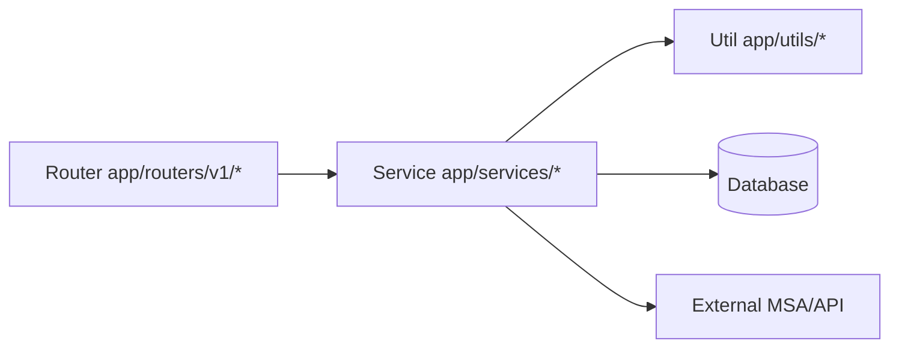

# Backend Quick Guide

This is a minimal quick-reference guide for backend contributors.
For full engineering rules, follow `src/backend/BACKEND.md`.
For backend test engineering rules, follow `src/backend/TEST.md`.
Localized docs rule: place translations under `docs/<locale>/backend/`.
Current locale example (`ko`): `docs/ko/backend/README.md`, `docs/ko/backend/BACKEND.md`, `docs/ko/backend/TEST.md`.

## 1) Core Rules

- Layering pattern: `Router -> Service -> Util/DB/MSA`
- Access environment variables through `SETTINGS` in `app/core/config/settings.py`
- If schema/models change, Alembic migration updates are required
- RBAC is enforced via dependencies in `app/deps.py` (for example admin-only guards)
- In `LOGIN_ENABLED=false` bootstrap mode, bootstrap user is provisioned/promoted as `admin`
- `PASSWORD_AUTH_ENABLED=false` disables legacy email/password entrypoints while keeping OAuth login available
- On startup, backend runs Alembic `upgrade head` against the active `DATABASE_URL` only (no downgrade path)
- API keys track cumulative usage (`request_count`) and optional expiration (`expires_at`)
- Realtime SSE stream is available at `/api/v1/events/stream` with heartbeat and Redis Pub/Sub fan-out
- Async background jobs use a generic Redis queue worker core (`app/core/task_queue/worker.py`) with domain/service adapters (for example `app/core/task_queue/services/mail.py`)
- Auth email templates are localized by request `Accept-Language` (`en`/`ko`) and propagated through the mail queue payload
- For auth mail language, `X-App-Language` header has priority over `Accept-Language`
- Every HTTP response includes request correlation headers (`X-Request-ID`, `X-Trace-ID`) and backend logs include the same context values
- Prometheus metrics are exposed at `/metrics` when `METRICS_ENABLED=true`
- OpenTelemetry tracing can be enabled with `TRACING_ENABLED=true` and exported through OTLP

## 1.1) Backend Flow



## 2) Setup

```bash
cd src/backend
uv sync
```

## 3) Run Server

```bash
cd src/backend
uv run uvicorn app.main:app --reload --port 8000
```

API docs:
- `http://localhost:8000/docs`

Cabinlog auth defaults:
- Password signup/login endpoints are disabled unless `PASSWORD_AUTH_ENABLED=true`.
- GitHub is the only OAuth provider listed by default (`OAUTH_ALLOWED_PROVIDERS=github`).
- Set `OAUTH_ENABLED=true` only after configuring `OAUTH_GITHUB_CLIENT_ID` and `OAUTH_GITHUB_CLIENT_SECRET`.

Prometheus metrics:
- `http://localhost:8000/metrics`

Health checks:
- `http://localhost:8000/health/live`
- `http://localhost:8000/health/ready`

OpenTelemetry tracing:
- Set `TRACING_ENABLED=true`
- Set `OTEL_EXPORTER_OTLP_ENDPOINT` to your collector endpoint, for example `http://localhost:4317`

Local Docker observability stack:

```bash
cd docker
docker compose --profile observability up -d tempo otel-collector prometheus grafana
```

Default Docker startup excludes observability services. Use `--profile observability` when Tempo, OpenTelemetry Collector, Prometheus, and Grafana are needed.

To run the full compose stack including the backend and observability services:

```bash
cd docker
docker compose --profile observability up -d
```

When the backend also runs through this compose file, use:

```env
TRACING_ENABLED=true
OTEL_EXPORTER_OTLP_ENDPOINT=http://otel-collector:4317
```

Grafana:
- `http://localhost:3000` (`admin` / `admin`)
- Provisioned dashboard: `B4FastAPI / FastAPI Overview`

Prometheus:
- `http://localhost:9090`

The local Prometheus config scrapes a backend started on the host machine:
- target: `host.docker.internal:8000`

If the backend is also started as the compose `app` service, change the Prometheus target to `app:8000`.

Trace flow:
- FastAPI app -> OpenTelemetry Collector -> Tempo -> Grafana

Metrics flow:
- FastAPI `/metrics` -> Prometheus -> Grafana

The provisioned FastAPI dashboard includes:
- backend target status
- request rate
- 5xx error ratio
- latency p95
- endpoint request rate and endpoint p95 latency

## 4) Lint / Format (Ruff)

```bash
cd src/backend
uv run ruff check . --fix
uv run ruff format .
```

Check-only mode:

```bash
cd src/backend
uv run ruff check .
uv run ruff format . --check
```

## 5) DB Migration (Alembic)

After model/schema changes:

```bash
cd src/backend
uv run alembic revision --autogenerate -m "describe-schema-change"
uv run alembic upgrade head
```

Rollback example:

```bash
cd src/backend
uv run alembic downgrade -1
```

## 6) Pre-Commit Checklist

```bash
cd src/backend
uv run ruff check . --fix
uv run ruff format .
```

Also verify:
- If DB changed, confirm Alembic revision/upgrade
- If behavior/rules changed, sync `AGENTS.md`, root `README.md`, and `src/backend/BACKEND.md`

## 7) Migration and Data Operations

- Migration failure handling: `src/backend/MIGRATION_ROLLFORWARD.md`
- DB backup/restore runbook: `src/backend/DB_BACKUP_RESTORE.md`
- Alembic revision rule:
1. `revision` format: `NNNN_snake_case`
2. max length: `32`

## 8) Tests (Domain/API Structure)

- Tests are organized by API domain under `tests/api/v1/<domain>/`.
- Current starter layout:
1. `tests/api/v1/auth/test_auth_api.py`
2. `tests/api/v1/api_key/test_api_key_api.py`

Run tests:

```bash
cd src/backend
uv run pytest
```
