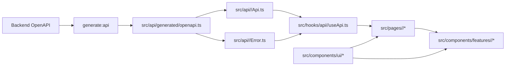

# Frontend Engineering Guide

This guide exists because the project is optimized for agentic coding patterns, and both agents and humans are expected to follow the same conventions to maintain highly consistent, high-quality outcomes.

## 0) Scope and Priority

- Scope: everything under `src/frontend`.
- Read order before frontend work:

1. Root `AGENTS.md`
2. This document (`src/frontend/FRONTEND.md`)
3. Test guide (`src/frontend/TEST.md`) when adding/changing tests

- Priority on conflicts:

1. Root `AGENTS.md`
2. This document
3. Local file comments and existing code style

## 0.1) Frontend Project Structure

```text
src/frontend/
  src/
    api/          # generated + domain API/error
    hooks/        # api hooks + app hooks
      connectivity/ # desktop server readiness/reconnect lifecycle
      realtime/   # stream subscription lifecycle hooks (non-API)
        core/     # shared stream lifecycle/reconnect hooks
        <domain>/ # domain-specific stream handlers (apiKey, ...)
    pages/        # page-group based (login/settings/main)
    components/
      ui/         # reusable UI components (category folders)
      features/   # domain-specific components
      layout/     # app shell/navigation
    styles/
    utils/
  scripts/
  public/
  src-tauri/    # optional Tauri desktop shell; browser frontend remains supported
```

## 0.2) Frontend Flow and Coupling



## 0.3) Frontend Runtime Loops

Use these loops as the default check when adding or changing frontend behavior. A loop can be marked not applicable, but the reason should be clear before committing.

### 0.3.1) API State Loop

User-driven API behavior should follow this path:

1. Page owns domain hook invocation and user action handling.
2. Domain hook calls the domain API wrapper.
3. Domain API wrapper uses generated OpenAPI types and domain error mapping.
4. Hook normalizes loading, success, and error state for the page.
5. Page passes state and actions into feature components through props.
6. UI refreshes from hook state instead of duplicating API state inside feature components.

Pages and feature components should not import `src/api/*` directly or bypass domain hooks.

### 0.3.2) Realtime Refresh Loop

When backend domain events should update visible UI state, use the realtime refresh loop:

1. Domain realtime hook subscribes through the shared realtime core.
2. Domain event parser validates and dispatches known event types.
3. Affected API state is refetched, invalidated, or updated in one domain-owned place.
4. Pages and feature components rerender from the refreshed hook state.

Keep reconnect/backoff behavior in `src/hooks/realtime/core/*`; keep domain event handling in `src/hooks/realtime/<domain>/*`.

### 0.3.3) Desktop Connectivity Recovery Loop

Packaged desktop behavior should follow this recovery loop:

1. Connectivity hook checks `/health/ready` and tracks desktop server readiness.
2. API and realtime work pause while readiness is unavailable.
3. Manual retry and backoff recovery keep disconnected UI stable.
4. After recovery, stale API/realtime state is refreshed before normal interaction resumes.

Browser runtime must not start desktop readiness polling, and desktop outages must not clear local user/session state.

### 0.3.4) UI Composition Loop

Visual and interaction changes should follow this loop before adding new markup, components, or CSS:

1. Check `src/components/ui/*`, `src/components/layout/*`, and existing feature components for a reusable control or pattern.
2. If the UI is reusable, implement or extend a shared component first and export it from `src/components/ui/index.ts` when applicable.
3. Use shared styles from `src/styles/app.css`; add a reusable class there when a style is likely to repeat.
4. Keep feature/page components focused on composition, state wiring, and domain-specific labels.
5. Verify compact controls have stable dimensions, text fits inside buttons, and internal text/icon spacing is consistent.
6. For collection controls such as pagination, use the shared button/control style, stable item sizing, disabled/current states, and no layout shift when labels or page numbers change.
7. Check the result at mobile and desktop widths before committing when the change affects layout or text fit.

Avoid one-off button spacing, inline pagination styles, page-local control CSS, or duplicated component variants unless the local exception is documented.

## 1) Formatting and Linting

- Prettier is the formatting source of truth for frontend code.
- Required before commit (run in `src/frontend`):

1. `npm run format`
2. `npm run format:check`

- Keep formatting and import organization aligned with the frontend VS Code settings file if present.

## 2) TypeScript Rules (Strict)

- TypeScript is mandatory for all frontend code.
- `tsconfig.json` strict mode must remain enabled.
- Avoid `any` unless there is no safe alternative.
- Prefer precise domain types imported from generated OpenAPI schemas.
- Public utilities, hooks, and API wrappers should always declare explicit input/output types.

## 2.1) Type Declaration Convention

- Naming/approach used in this project:

1. Strict TypeScript
2. Explicit typing
3. Contract-first typing (generated OpenAPI types first)

- Declaration rules:

1. Prefer `type` aliases by default.
2. Use `interface` only when extension/implementation semantics are clearly required.
3. Props types must use `XxxProps` naming.
4. API-related local types must use clear suffixes such as `Request`, `Response`, `ErrorDetail`.
5. Keep domain-local types near the domain module; avoid broad global type dumping.
6. Do not introduce `any` without a concrete reason and fallback plan.

## 3) API Contract Rule (`generate:api`, Required)

- Backend OpenAPI is the source of truth for API contracts.
- Required generation source:

1. `http://localhost:8000/openapi.json`

- Required generated file:

1. `src/api/generated/openapi.ts`

- Rules:

1. Use generated types from `src/api/generated/openapi.ts` in API/hook/page layers.
2. Do not maintain duplicate handwritten contract types for OpenAPI-backed endpoints.
3. If backend API schema changes, run `npm run generate:api` before API call site edits.
4. `npm run build` is server-independent by default (no OpenAPI fetch during build).
5. Use `npm run build:sync` for optional API refresh + build.
6. Use `npm run build:strict` (or `npm run generate:api`) when strict OpenAPI refresh from backend is required.

## 4) Domain API/Error/Hook Rule (1:1:1, Required)

- Domain modules must be co-located under `src/api/<domain>/`.
- Each domain must include:

1. `<domain>Api.ts`
2. `<domain>Error.ts`
3. `src/hooks/api/<domain>/use<Domain>Api.ts`

- Examples:

1. Auth router domain -> `src/api/auth/authApi.ts` + `src/api/auth/authError.ts` + `src/hooks/api/auth/useAuthApi.ts`
2. API key router domain -> `src/api/apiKey/apiKeyApi.ts` + `src/api/apiKey/apiKeyError.ts` + `src/hooks/api/apiKey/useApiKeyApi.ts`
3. Events router domain -> `src/api/events/eventsApi.ts` + `src/api/events/eventsError.ts` + `src/hooks/api/events/useEventsApi.ts`

- When a new backend router/domain is added, frontend must add the same domain 1:1:1 set in the same work cycle.
- Do not place domain error parsing/mapping in `src/utils`; keep it inside each domain API folder.
- API interface chain is mandatory:

1. `generated_api_schema`
2. `api/<domain>`
3. `hooks/api/<domain>`
4. actual usage (`pages/components`)

- Realtime stream note:

1. If backend auth for stream requires bearer token, do not use native `EventSource` for authenticated streams.
2. Use `fetch` streaming in domain API layer so `Authorization` header can be sent.
3. Reconnect/backoff policy should be implemented in `src/hooks/realtime/core/*`.
4. Domain event parsing/dispatch logic should be implemented in `src/hooks/realtime/<domain>/*`.

- Desktop connectivity note:

1. Packaged Tauri runtime readiness is checked through `/health/ready`; `navigator.onLine` is only a hint.
2. Desktop reconnect/backoff ownership stays in `src/hooks/connectivity/*`.
3. Browser runtime must not start desktop readiness polling.
4. Realtime subscriptions must pause while desktop readiness is unavailable and resume after recovery.
5. Missing `/config` data must fail closed; only an explicit `login_enabled=false` response may unlock login-disabled routes.
6. Desktop outage status belongs beside the app-navbar profile control or standalone/public-navbar tools, not in a page-wide overlay.
7. App and public navbars must use symmetric outer columns and reserve compact status width so status label changes never shift the centered title.
8. Manual retry UI must avoid flashing transient loading states; keep the disconnected label stable and only show heavier loading affordances after a short delay.
9. Profile-menu sign-out must be disabled while packaged desktop connectivity is not `online`; do not clear the local user or route to `/login` during a server outage.

- `pages/components` must not import from `src/api/*` directly; they must consume domain hooks only.
- API hooks must be placed under `src/hooks/api/<domain>/*`.
- Non-API hooks (state/session/i18n/feature/auth-context) must stay outside `src/hooks/api/*`.
- Page and hook responsibility rule:

1. Domain hook invocation is owned by page layer.
2. Pages must be organized by concrete page groups (for example `pages/login`, `pages/settings`, `pages/main`).
3. Domain feature components should receive state/actions via props and should not call domain API hooks directly.
4. Components may use non-domain hooks (for example UI state/i18n) when needed.

## 5) Error Code Handling Rule

- Error handling must be based on backend-defined error codes and generated schema types.
- Maintain exhaustive code-to-message mapping with `Record<ErrorCode, ...>` style patterns.
- When new backend error codes appear, frontend mapping must fail fast at compile time until explicitly handled.
- Normalize unknown/non-schema errors to a safe fallback message path, while preserving known code branches.

## 6) Component and Style Rule (Showcase-First)

- Reuse shared UI components first, then feature-level components, then page composition.
- Component directory responsibilities:

1. `src/components/ui/*`: low-level reusable primitives
2. `src/components/layout/*`: app shell/navigation/layout-level components
3. `src/components/features/<domain>/*`: domain-specific feature components

- Required component priority:

1. `src/components/ui/*`
2. `src/components/layout/*` when composition reuse is needed
3. `src/components/features/<domain>/*` for domain-bound compositions
4. `src/pages/*` (composition-focused, minimal raw markup)

- Before creating a new component:

1. Check whether an equivalent component already exists in shared UI.
2. Check whether it belongs to `ui` (reusable) or `features/<domain>` (domain-specific).
3. Create it as a component unit, not inline page markup.
4. If a new reusable UI component is added, register a usage example in `src/pages/main/ShowCasePage.tsx`.

- UI folder rule:

1. Place UI components under category folders by component nature (`buttons`, `cards`, `dropdowns`, `lists`, `inputs`, `switches`, `toggles`, etc.).
2. Keep `src/components/ui/index.ts` as the export entry and update it whenever UI files are added/moved.

- Style rules:

1. All frontend CSS must be managed in `src/styles/app.css`.
2. Do not add separate page/component CSS files unless a documented exception is approved.
3. Avoid one-off style duplication when a reusable class or component style can be extracted.
4. Scrollbars must follow the global rules in `src/styles/app.css` so every scrollable container keeps a consistent style.

## 6.1) Collection Navigation and Overflow Rule

- Use industry-standard collection patterns instead of unbounded card rendering:

1. Card collections that can exceed 6 items must use pagination by default.
2. Use `client-side pagination` only when the current API already returns the complete bounded collection; use `server-side pagination` or `cursor pagination` when the collection can grow without a predictable upper bound.
3. Pagination controls must render as a numbered pager with a pagination window: boundary pages, nearby sibling pages, and ellipsis truncation, for example `1 2 3 4 5 ... 12` or `1 ... 4 5 6 ... 12`.
4. Pagination controls must expose accessible labels, `aria-current="page"` for the active page, and previous/next icon buttons.
5. Paginated card lists must preserve layout stability across pages by reserving the same page-size slots on short final pages, so the content area's height and width do not shrink when fewer items remain.
6. Long card lists must be wrapped in an overflow-contained `scroll container` with explicit `max-height` or layout constraints, so content does not push navigation, headers, or neighboring panels off-screen.
7. Avoid nested page-level scrolling. Prefer one bounded content scroll region inside the affected panel and keep global scrollbars following `src/styles/app.css`.

## 7) Build and Runtime Notes

- Install dependencies:

1. `npm ci` (or `npm install` when lockfile update is intended)

- Local dev:

1. `npm run dev`
2. `npm run tauri:dev` for the optional desktop shell (requires Rust)

- Production build:

1. `npm run build`
2. `npm run build:sync` (optional backend OpenAPI refresh)
3. `npm run build:strict` (requires backend OpenAPI endpoint)
4. `npm run build:desktop` builds shared assets without copying them to FastAPI

- The build pipeline includes copying frontend artifacts into backend static path through `scripts/copy-to-backend.mjs`.

## 8) Internationalization Rule (Required)

- All user-facing text must be managed through i18n keys.
- Do not hard-code display strings in pages/components/modals/buttons/messages.
- Add or update locale entries first (for example `src/locales/en.json`), then reference keys in UI.
- Exception: non-user-facing internal identifiers (for example API field names, enum values, route paths) can remain as literals.

## 9) Completion Checklist

1. TypeScript strict mode preserved and no unnecessary `any`
2. API types regenerated when backend contract changed
3. New backend domains include frontend domain pair (`<domain>Api.ts` + `<domain>Error.ts`)
4. Error code maps are exhaustive for added backend codes
5. Shared components reused before page-level raw markup
6. All user-visible text is i18n-key based
7. Prettier format and check completed (`npm run format`, `npm run format:check`)
8. Frontend automated tests completed (`npm run test`)
9. Type checking completed (`npx tsc --noEmit` or `npm run build`, where build includes `tsc`)
